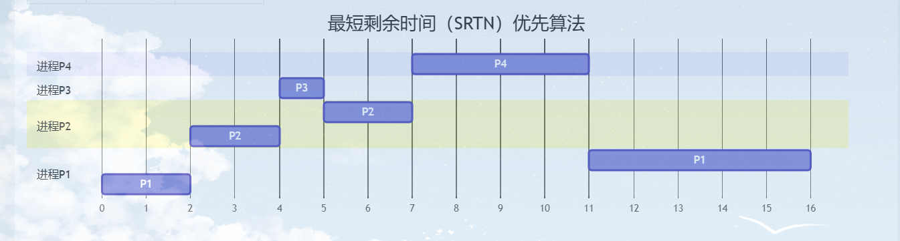

> ## 进程调度算法

### 0 进程调度算法的性能评价指标

- CPU利用率 

  - $$
    CPU利用率  =  CPU有效工作时间 / (CPU有效工作时间+ CPU空闲等待时间)
    $$

- 周转时间 

  - 周转时间就是一个作业提交开始到作业执行完成所花费的时间，包括 等待、排队、CPU运行，以及IO操作的时间的总和

  - $$
    周转时间 = 作业完成时间 - 作业提交时间
    $$

- 平均周转时间 

  - 平均周转时间是多个作业周转时间的平均值

  - $$
    平均周转时间 =  （作业1周转时间 + 作业2周转时间 ..... + 作业n周转时间n） / n
    $$

- 带权周转周期是指的是作业周转时间与作业实际运行的时间的比值

  - 

  - $$
    带权周转时间 = 作业周转时间 / 实际运行时间 = (作业完成时间 - 作业提交时间) / 实际运行时间
    $$

  

- 平均带权周转时间 是多个作业的带权周转时间的平均值

  - $$
    平均带权周转时间 =  （作业1带权周转时间 + 作业2带权周转时间 ..... + 作业n带权周转时间n） / n
    $$

- 

- 系统吞吐量 表示单位时间内完成的作业数量

  - $$
    吞吐量 = 完成作业数目 / 所花费的时间
    $$

##  1 【非抢占式】 先来先服务 FCFS 调度算法  

- **【规则】**：先来先服务，先执行先到达的作业，按各个进程到达的先后顺序进行服务

- **【优点】**：对每一个进程都是公平的，算法时间简单

- **【缺点】**：对于短算法来说，如果短作业前面是一个长作业，就会导致本来我的执行时间很短，这个作业的周转时间里很大的一部分都给了排队等待， 短作业的带权周转时间高

- **【饥饿】**：由于FCFS根据排队的先后依次执行 不会导致饥饿行为

- **【案例】**：

  - | 进程 | 到达时间 | 运行时间 |
    | :--: | :------: | :------: |
    |  P1  |    0     |    7     |
    |  P2  |    2     |    4     |
    |  P3  |    4     |    1     |
    |  P4  |    5     |    4     |

  - **【分析】 **：对于这个案例中的进程 由于是先来先服务的

    - 时间 0 P1到达 由于现在处理机空闲 可以直接运行作业P1 运行了 2个时间单位后  P2 到达此时P2 在队伍中的第一个

    - P1 运行 4 个单位后 P3 到达 P1 继续运行 一个单位后 P4 到达 然后 知道第7个时间单位  P1 运行结束下处理机，然后此时 队列中的 顺序是 P2、P3、P4 选择P2 上处理机，运行4个单位时间，然后轮到P3 继续运行1个时间单位 最后到P4 运行 4 个时间单位

    - | 关键时刻 |  就绪队列  |               备注                |
      | :------: | :--------: | :-------------------------------: |
      |    0     |     P1     |              P1就绪               |
      |    0     |     #      |          P1上处理机运行           |
      |    2     |     P2     |         P2 到达 准备就绪          |
      |    4     |   P2->P3   |        P3 到达 排在P2后面         |
      |    5     | P2->P3->P4 |        P4 到达 排在P3后面         |
      |    7     |   P3->P4   |   P1执行完成  P2 出队 上处理机    |
      |    11    |     P4     | P2 执行完成 下处理机  P3 上处理机 |
      |    12    |     #      |      P3 执行完成 P4 上处理机      |
      |    16    |     #      |        P4执行完毕 下处理机        |

    - 性能指标

      - |              性能指标               |   P1    |     P2      |     P3      |     P4      |
        | :---------------------------------: | :-----: | :---------: | :---------: | :---------: |
        |              周转时间               | 7-0 = 7 |  11-2 = 9   | 12 - 4 =  8 | 16 - 5 = 11 |
        |            带权周转时间             | 7/7 = 1 | 9/4  = 2.25 |   8/1 = 8   | 11/ 4=2.75  |
        | 等待时间    **周转时间 – 运行时间** | 7-7 = 0 |   9-4 = 5   |   8-1 = 7   |  11-4 = 7   |

      - 平均周转时间就是 （7+9+8+11） /  4  = 8.75

      - 平均带权周转时间 就是 （1+2.25+8+2.75） / 4 = 3.5

      - 平均等待时间 为 （0+5+7+7） / 4 =  4.75

## 2 【非抢占式+抢占式】短进程优先(SPF) 调度算法

###    2.1 【非抢占式】 短进程优先 (SPF) 调度算法

- **【规则】 **：每次调度是  要检查**已到达队列**里的**估计用时最短**的作业 进行执行 

- **【优点】 **：拥有"最短的"平均等待时间、平均周转时间

- **【缺点】 **：对短进程有利,但是对长进程不利,另外,作业的预估用时是用户提供的 不一定真实我可以一个很长的作业 提供一个很短的预估用时,不一定能做到真正的短作业优先

- **【饥饿】 **：会导致饥饿 如果 队列里源源不断的进来短进程 就会导致长进程永远执行不了产生"饥饿"现象

- **【案例】**： 

  - | 进程 | 到达时间 | 运行时间 |
    | :--: | :------: | :------: |
    |  P1  |    0     |    7     |
    |  P2  |    2     |    4     |
    |  P3  |    4     |    1     |
    |  P4  |    5     |    4     |

    - **【分析】**：对于这个案例中的进程 由于是短作业优先 首先 时间0 P1到达 此时CPU空闲 直接上处理机运行 知道运行到2时间段 此时P1的剩余运行时间 为 5 此时 P2 加入就绪队列 由于是**非抢占式短作业优先** 不会剥夺P1的处理及资源 然后让处理机运行,运行到4 时间段 P3 到达 运行 到 5 时间段 P4 到达,然后到了时间段7 P1执行结束下处理及 P2,P3,P4中预估运行时间最少的为P3 此时让P3 上处理机,运行一个时间段后 也就是到8这个时间 P3 下处理机 然后P2P4 两个进程的由于预估运行时间相同,然后就按照FCFS的顺序 先执行P2 在执行P4

    - 

    - | 关键时刻 |  就绪队列  |                   备注                    |
      | :------: | :--------: | :---------------------------------------: |
      |    0     |     P1     |                  P1就绪                   |
      |    0     |     #      |              P1上处理机运行               |
      |    2     |     P2     |             P2 到达 准备就绪              |
      |    4     |   P2->P3   |                  P3到达                   |
      |    5     | P2->P3->P4 |                  P4到达                   |
      |    7     |   P2->P4   | P1执行结束 选择运行时间最短的作业上处理机 |
      |    8     |     P4     |           P3执行结束 P2上处理机           |
      |    12    |     #      |          P2执行结束 P4 上处理机           |
      |    16    |     #      |                P4 执行结束                |

    - 性能指标

      - 

      - |              性能指标               |   P1    |     P2      |   P3    |     P4      |
        | :---------------------------------: | :-----: | :---------: | :-----: | :---------: |
        |              周转时间               | 7-0 = 7 | 12 - 2 = 10 | 8-4 = 4 |   16-5=11   |
        |            带权周转时间             | 7/7 = 1 | 10/4 = 2.5  | 4/1 = 4 | 11/4 = 2.75 |
        | 等待时间    **周转时间 – 运行时间** | 7-7 = 0 |  10-4 = 6   | 4-1 = 3 |  11-4 = 7   |

      - 平均周转时间 = (7+10+4+11) / 4 = 8

      - 平均带权周转时间 = (1+2.5+4+2.75) = 2.56

      - 平均等待时间 = (0+6+3+7) / 4 = 4

###   2.2 【抢占式】 短进程优先 (SRTN) 调度算法

- **【规则】**：**每次就绪队列里插入新进程时**要检查 **当前运行的进程的剩余时间** 和 **新加入的进程的剩余时间** 如果新到达的最短剩余时间短于正在运行的进程 就由新进程抢占处理机,当前运行的进程回到就绪队列 **(与非抢占式做比较)**

- **【优点】**：拥有"最短的"平均等待时间、平均周转时间

- **【缺点】**：对短进程有利,但是对长进程不利,另外,作业的预估用时是用户提供的 不一定真实我可以一个很长的作业 提供一个很短的预估用时,不一定能做到真正的短作业优先

- **【饥饿】**：会导致饥饿 如果 队列里源源不断的进来短进程 就会导致长进程永远执行不了产生"饥饿"现象

- **【案例】**：

  - | 进程 | 到达时间 | 运行时间 |
    | :--: | :------: | :------: |
    |  P1  |    0     |    7     |
    |  P2  |    2     |    4     |
    |  P3  |    4     |    1     |
    |  P4  |    5     |    4     |

    - **【分析】**：对于这个案例中的进程 由于是短作业优先 首先 时间0 P1到达 此时CPU空闲 直接上处理机运行 知道运行到2时间段 此时P1的剩余运行时间 为 5 此时 P2 加入就绪队列 由于是**抢占式短作业优先**  直接剥夺P1的处理机资源 换P2 执行 P2执行了 2个时间段 P3到达 由于 此时P2的剩余时间是2 P3 的剩余时间是1 这时 剥夺P2 处理机资源  P3 上处理机 运行一个时间后 P4 到达 同时P3 也运行结束下处理机，此时 队列中 P1 P2 P4 都未执行完 P1 的剩余时间为 5 P 2 是 2 P4 = 4首先执行P2 然后执行P4 最后执行P1

    - 

    - | 关键时刻 |  就绪队列  |                     备注                      |
      | :------: | :--------: | :-------------------------------------------: |
      |    0     |     P1     |                    P1就绪                     |
      |    0     |     #      |                P1上处理机运行                 |
      |    2     |     P2     |               P2 到达 准备就绪                |
      |    2     |     P1     | 由于P2的剩余时间小于P1   抢占P1处理机 P1（5） |
      |    4     |   P1，P3   |                    P3到达                     |
      |    4     |   P1，P2   | 由于P3的剩余时间小于P2   抢占P2处理机 P2（2） |
      |    5     | P1，P2，P4 |             P4到达同时P3 执行完毕             |
      |    5     |   P1，P4   |                    执行P2                     |
      |    7     |     P1     |            P2执行结束 P4 上处理机             |
      |    11    |     #      |             P4执行结束 P1上处理机             |
      |    16    |     #      |                  P1运行结束                   |

|              性能指标               |      P1       |     P2     |   P3    |    P4     |
| :---------------------------------: | :-----------: | :--------: | :-----: | :-------: |
|              周转时间               |   16-0=  16   | 7 - 2 = 5  | 5-4 =1  | 11-5 = 6  |
|            带权周转时间             | 16 / 7 = 2.28 | 5/4 = 1.25 | 1/1 = 1 | 6/4 = 1.5 |
| 等待时间    **周转时间 – 运行时间** |   16-7 = 9    |  5-4 = 1   | 1-1 = 0 |  6-4 = 2  |

- 平均周转时间 = (16+5+1+6) / 4 = 7
- 平均带权周转时间 = (2.28+1.25+1+1.5) = 1.5
- 平均等待时间 = (9+1+0+2) / 4 = 3

# 3 【非抢占式】高响应比优先（HRRN）调度算法

- **响应比** = **(等待时间 + 要求服务时间) / 要求服务时间**

- **【规则】**：调度时 计算所有就绪队列的响应比

- **【优点】**：综合考虑了等待时间和运行时间 

  - 等待时间相同，要求运行时间短的优先 （SPF的优点）
  - 运行时间相同时，按照先来先服务 FCFS 的特点
  - 对于长作业来说等待的时间越久，响应比就会越高不会出现饥饿的情况

- **【缺点】**：暂无 2025年05月11日

- **【饥饿】**：长作业等待的时间越久响应比越高  则不会出现饥饿现象

- **【案例】**：

  - | 进程 | 到达时间 | 运行时间 |
    | :--: | :------: | :------: |
    |  P1  |    0     |    7     |
    |  P2  |    2     |    4     |
    |  P3  |    4     |    1     |
    |  P4  |    5     |    4     |

    - **【分析】**：对于这个案例中的进程 0时刻 P1 进入就绪队列 P1的响应比为  （0+7 / 7）  = 1 进入处理机 运行到2 这个时刻 P2 加入就绪队列 此时P1继续运行 到了时间4 P3 到达 此时 到了时间5 P4 到达 一直到 7这个时间 P1 运行完毕 此时计算P2 P3，P4 的响应比 P2 =  （5+4 / 4  = 2.25 P3  = （3+1） /  1 = 4  P4  = （4+2 ）/ 4 = 1.5 选择最高的一个 上处理机 ，后面的操作雷同

    - 

    - | 关键时刻 |                           就绪队列                           |          备注          |
      | :------: | :----------------------------------------------------------: | :--------------------: |
      |    0     |                              P1                              |         P1就绪         |
      |    7     | P2(7-2+4) / 4 = 2.25，P3(7-4 + 1) / 1 = 4，P4 (7-5+4)/4 = 1.5 |       P1下处理机       |
      |    7     |                            P2,P4                             | P3响应比最高，上处理机 |
      |    8     |      P2 = （8-2+4）/4  = 2.5，P4 = （8-5+4 ）/ 4 = 1.75      |       P3下处理机       |
      |    8     |                   P4【响应比(3+4)/4=1.75】                   |        P2 运行         |
      |    12    |                   P4【响应比(7+4)/4=2.75】                   |       P4 已就绪        |
      |    16    |                              #                               |       P4运行结束       |

# 4 【抢占式】时间片轮转 调度算法

- **【规则】 **：时间片轮转主要是用与分时操作系统，所有的就绪队列按照FCFS策略排成一个队列。系统可以设置每隔一定的时间 将就绪队列的队头的进程分配处理机，如果当前处理机有正在运行的进程 即使没有运行完毕 也被**剥夺**处理机，被剥夺处理机的进程插入到队尾元素，**进程运行完会主动放弃处理机，此时也需要按上述规则进行调度**

- **【优点】**：公平，响应快，适用于分时操作系统

- **【缺点】**：如果一个时间片设置的太小的话，进程切换也会耗费资源，则大量的系统资源浪费在了切换进程上。不区分任务的紧急性

- **【饥饿】**：不会导致饥饿

- **【时间片设置不合理的影响】**：

  - 如果时间片设置的太大，每个进程都可以在一个时间片的时间内执行结束则退化为**FCFS算法**。
  - 如果时间片设置的太小，进程切换的更加频繁，则大量的系统资源浪费在切换进程上。从而实际执行的时间比例减少

- **【注意】**：常用于分时操作系统，更注重“响应时间”，因而此处不计算周转时间

- **【案例】**：调度时只做两件事：（1）时间片用完的进程放到队尾排队；（2）取队头进程上处理机

  - ## 案例一：时间片为 2

  - | 进程 | 到达时间 | 运行时间 |
    | :--: | :------: | :------: |
    |  P1  |    0     |    5     |
    |  P2  |    2     |    4     |
    |  P3  |    4     |    1     |
    |  P4  |    5     |    6     |

  - 安师大

  - 

  - | 关键时刻 | 就绪队列 （括号内为剩余运行时间） |            备注            |
    | :------: | :-------------------------------: | :------------------------: |
    |    0     |               P1(5)               |           P1就绪           |
    |    0     |                 #                 |       P1上处理机运行       |
    |    2     |           P2(4)->P1(3)            | P1时间片用完，加入就绪队列 |
    |    2     |               P1(3)               |         P2上处理机         |
    |    4     |           P1(3)->P3(1)            |           P3到达           |
    |    4     |        P1(3)->P3(1)->P2(2)        | P2时间片用完 加入就绪队列  |
    |    4     |           P3(1)->P2(2)            |         P1上处理机         |
    |    5     |        P3(1)->P2(2)->P4(6)        |     P4到达加入就绪队列     |
    |    6     |        P2(2)->P4(6)->P1(1)        |   P1执行结束,P3上处理机    |
    |    7     |           P4(6)->P1(1)            |   P3执行结束,P2上处理机    |
    |    9     |               P1(1)               |   P2执行结束,P4上处理机    |
    |    11    |               P4(4)               |   P4执行结束,P1上处理机    |
    |    12    |                 #                 |   P1执行结束,P4上处理机    |
    |    14    |               P4(2)               |         P4执行结束         |
    |    14    |                 #                 |         P4上处理机         |
    |    16    |                 #                 |         P4执行结束         |

  - ## 案例一：时间片为 5  时间片过大

  - | 进程 | 到达时间 | 运行时间 |
    | :--: | :------: | :------: |
    |  P1  |    0     |    5     |
    |  P2  |    2     |    4     |
    |  P3  |    4     |    1     |
    |  P4  |    5     |    6     |

  - 

  - | 关键时刻 | 就绪队列 （括号内为剩余运行时间） |           备注           |
    | :------: | :-------------------------------: | :----------------------: |
    |    0     |               P1(5)               |          P1就绪          |
    |    0     |                 #                 |      P1上处理机运行      |
    |    2     |               P2(4)               |      P2加入就绪队列      |
    |    4     |           P2(4)->P3(1)            |      P3加入就绪队列      |
    |    5     |           P2(4)->P3(1)            |        P1执行结束        |
    |    5     |               P3(1)               |        P2上处理机        |
    |    5     |           P3(1)->P4(6)            |          P4到达          |
    |    9     |           P3(1)->P4(6)            |        P2执行结束        |
    |    9     |               P4(6)               |        P3上处理机        |
    |    10    |               P4(6)               |        P3执行结束        |
    |    10    |                 #                 |        P4上处理机        |
    |    15    |                P4                 | P4时间片执行结束下处理及 |
    |    15    |                 #                 |        P4上处理机        |
    |    16    |                 #                 |        P4执行结束        |

# 5 【非抢占式+抢占式】优先级调度算法

## 5.1 【非抢占式】优先级调度算法

- **【规则】 **：每次调度时选择当前已到达且优先级最高的进程,当前进程主动放弃处理机时发生调度

- **【优点】**：用优先级区分紧急程度、重要程度，适用于实时操作系统。可灵活地调整对各种进程的偏好程度

- **【缺点】**：若有源源不断的高优先级的进程到来,则可能产生饥饿

- **【饥饿】**：会产生饥饿

- **【案例】**：（优先数越大，优先级越高）

  - 

  - | 进程 | 到达时间 | 运行时间 | 优先级 |
    | :--: | :------: | :------: | :----: |
    |  P1  |    0     |    5     |   1    |
    |  P2  |    2     |    4     |   2    |
    |  P3  |    4     |    1     |   3    |
    |  P4  |    5     |    6     |   2    |

  - 

  - | 关键时刻 | 就绪队列 （括号内为优先级） |    备注    |
    | :------: | :-------------------------: | :--------: |
    |    0     |            P1(1)            |   P1就绪   |
    |    0     |              #              | P1上处理机 |
    |    2     |            P2(2)            |   P2就绪   |
    |    4     |         P2(2),P3(3)         |   P3就绪   |
    |    5     |         P2(2),P3(3)         | P1运行结束 |
    |    5     |            P2(2)            | P3上处理机 |
    |    6     |         P2(2),P4(2)         |   P4就绪   |
    |    6     |         P2(2),P4(2)         | P3运行结束 |
    |    6     |            P4(2)            | P2上处理机 |
    |    10    |            P4(2)            | P2运行结束 |
    |    10    |              #              | P4上处理机 |
    |    16    |              #              | P4运行结束 |

## 5.2 【抢占式】优先级调度算法

- **【规则】 **：

  - 每次调度时选择当前已到达且优先级最高的进程
  - 当前进程主动放弃处理机时发生调度
  - 当就绪队列发生改变时也需要检查是会发生抢占

- **【优点】**：用优先级区分紧急程度、重要程度，适用于实时操作系统。可灵活地调整对各种进程的偏好程度

- **【缺点】**：若有源源不断的高优先级的进程到来,则可能产生饥饿

- **【饥饿】**：会产生饥饿

- **【案例】**：（优先数越大，优先级越高）

  - 

  - | 进程 | 到达时间 | 运行时间 | 优先级 |
    | :--: | :------: | :------: | :----: |
    |  P1  |    0     |    7     |   1    |
    |  P2  |    2     |    4     |   2    |
    |  P3  |    4     |    1     |   3    |
    |  P4  |    5     |    4     |   2    |

  - 

  - | 关键时刻 | 就绪队列 （括号内为优先级） |  备注  |
    | :------: | :-------------------------: | :----: |
    |    0     |            P1(1)            | P1就绪 |
    |    0     |              #              | P1执行 |
    |    2     |            P2(2)            | P2就绪 |
    |    2     |            P(1)             | P2执行 |
    |    4     |         P3(3),P1(1)         | P3就绪 |
    |    4     |         P2(2),P1(1)         | P3执行 |
    |    5     |      P2(2),P1(1),P4(2)      | P4就绪 |
    |    5     |      P2(2),P1(1),P4(2)      | P3完成 |
    |    5     |         P1(1),P4(2)         | P2执行 |
    |    7     |         P1(1),P4(2)         | P2完成 |
    |    7     |            P1(1)            | P4执行 |
    |    11    |            P1(1)            | P4完成 |
    |    11    |              #              | P1执行 |
    |    16    |              #              | P1完成 |

## 5.3 优先级的设置

​	根据进程创建后     其优先级是否可以改变分为

- 静态优先级   创建进程时确定，之后一直不变
- 动态优先级   创建进程时有一个初始值，之后会根据情况动态地调整优先级
  - 如果某进程在就绪队列中等待了很长时间，则可以适当提升其优先
  - 如果某进程占用处理机运行了很长时间，则可适当降低其优先级
  - 如果发现一个进程频繁地进行 I/O 操作，则可适当提升其优先级
- 优先级的设置一般遵守：
  - 系统进程优先级 > 用户进程
  - 前台进程优先级 > 后台进程 或者 交互型进程 大于 非交互型进程
  - I/O 型进程（频繁使用 I/O 设备的进程） > 计算型进程（频繁使用 CPU 的进程）

# 6 【抢占式】多级反馈队列调度算法

- **【规则】 **：设置多个优先级的队列,第一级优先级最高 相对的 执行的时间片大小也最短,越往下优先级次之 但是时间片大小会变大,只有 高优先级的队列为空时 才会执行低优先级的 队列中的任务,如果 执行低优先级任务的同时 **高优先级的队列插入了新进程,则新进程会立刻抢占处理机**
- **【优点】**：融合了 FCFS,短作业优先,高响应比,时间片轮转等调度算法的优点.
- **【缺点】**：若有源源不断的高优先级的进程到来,则可能产生饥饿
- **【饥饿】**：会产生饥饿