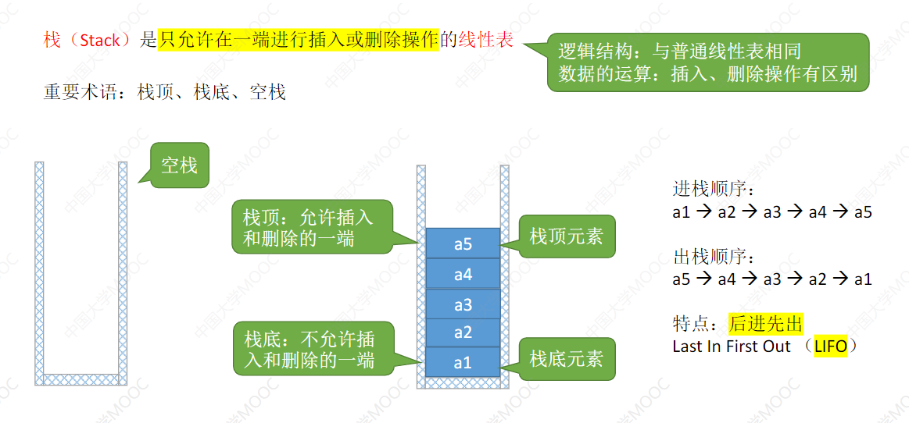
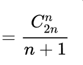
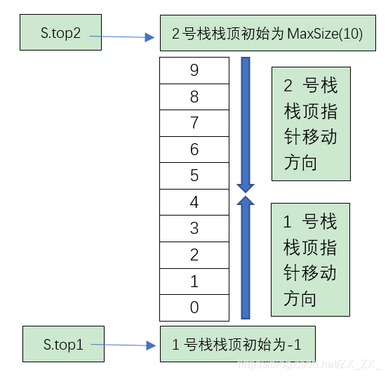

> 3.1.1栈的基本概念

栈是一种只允许在一端进行插入和删除的线性表，也就是所谓的操作受限的线性表



这个图片就是栈的基本的情况，栈的特点是只能操作栈顶的元素，也就是只能在栈顶进行插入以及删除，栈底的元素是第一个进入的，栈的特点是**==后进先出==** （Last In First Out）（LIFO）

> 3.1.2栈的基本操作

- InitStack(&S):初始化栈;
- StackEmpty(S)判断一个栈是否为空,如果栈为空则返回true;
- Push(&S,x): 向栈顶加入一个元素,如果栈满则提示栈满;
- Pop(&S,&x):如果栈不空则弹出栈顶的元素;
- GetTop(&S,&x):如果栈不空则将栈顶的元素赋值给x
- DestoryStack(&S):销毁栈释放栈的存储空间

> 3.1.3 卡特兰数

​	卡特兰数用来计算n个不同的元素进栈的时候有多少种不同的出栈顺序

​	

见王道课本P65

> 3.1.4 栈的存储结构

栈作为一种特殊的线性表,存储结构分为顺序栈和链栈

顺序存储结构可以描述为:

```C
#define MaxSize = 10
typedef struct {
    ElemType = data[MaxSize];
    int top; //top指针指向的栈顶的数组下标
}SqStack
```

栈顶指针为 top 刚开始初始化时设置为-1

栈顶元素:S.data[top]

栈空条件:S.top == -1;

栈满条件S.top == MaxSize - 1;

栈的长度 等于 S.top+1;

> 3.1.5 栈的基本操作实现

初始化 栈

```C
void InitStack(&S){
    S.top = -1;
}
```

判断栈是否为空

```C
bool StackEmpty(S){
    if(S.top == -1){
        return true;
    }
    return false;
}
```

进栈

```C
bool Push(&S,X){
    //判断是否栈满
    if(S.top == MaxSize - 1){// 栈满 或者 S.top+1 = MaxSize
        return false;
    }
    /*
    因为栈顶指针top 从一开始指向的是-1 这个下标,每次插入的时候都需要先将top++指向当前栈顶元素的
    如果top初始化的时候为0 则这部分处理应该是这样
    S.data[top] = x;
    S.top++;
    */
    S.top++;
    S.data[top] = x;
    return true;
}
```

出栈

```C
bool Pop(&S,&x){
	//判断是否栈空
	if(S.top == -1){ // top指向-1则表示栈空如果初始化的时候栈顶指针指向的是0 则该判断条件应该变为S.top == 0
		return false;//栈空
	}
	/**
	同样如果top指针初始化的时候为0的话 此时这个操作应该是 
	S.top--;
	x = S.data[top];
	*/
	X = S.data[top];
	S.top--;
	return true;
}
```

读取栈顶元素

```C
//其实读栈顶元素就是pop操作少了一个向下移动指针
Bool GetHead(&S,&x){
    //判断栈空
    if(S.top == -1){
        return false
    }
    /**
    如果top 初始化为0的话 top -1  的才是当前栈顶元素
    x = S.data[top - 1];
    */
    x = S.data[top];
}
```

> 3.1.6 共享栈



共享栈就是如果有一大片连续空间 单独一个栈用起来无法充分利用这些空间 设置两个栈来共享同一片空间

S.top1 初始化 = -1 S.top2初始化 = MaxSize 

也就是 top1 == -1 时 1好栈为空 

top2 == MaxSize 时 2号栈为空

**两个栈相邻时(top2 - top1 == 1) 栈满**

