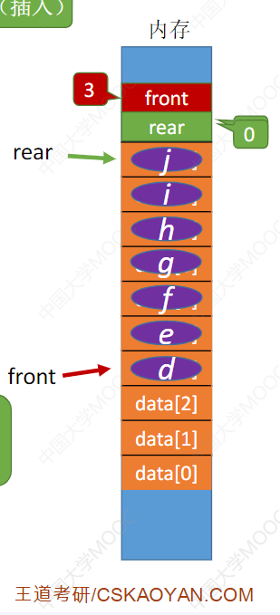
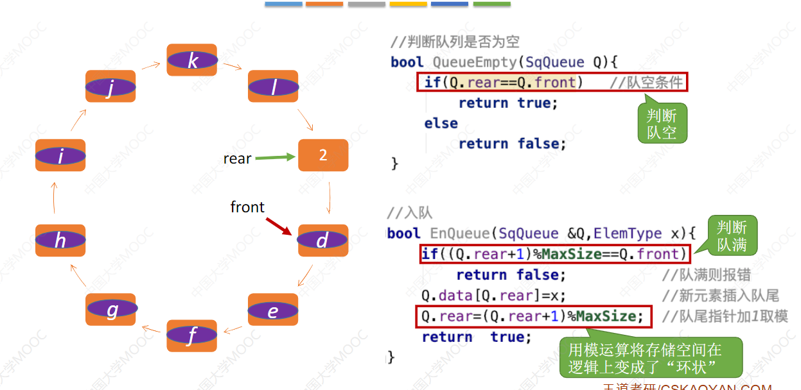
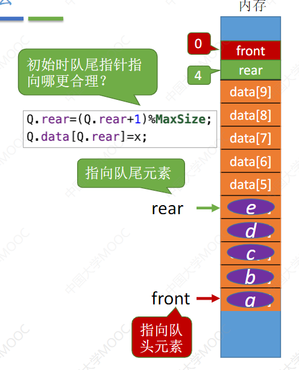
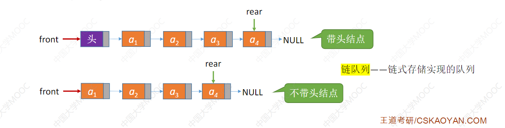
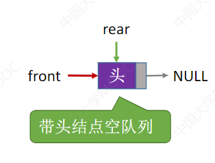
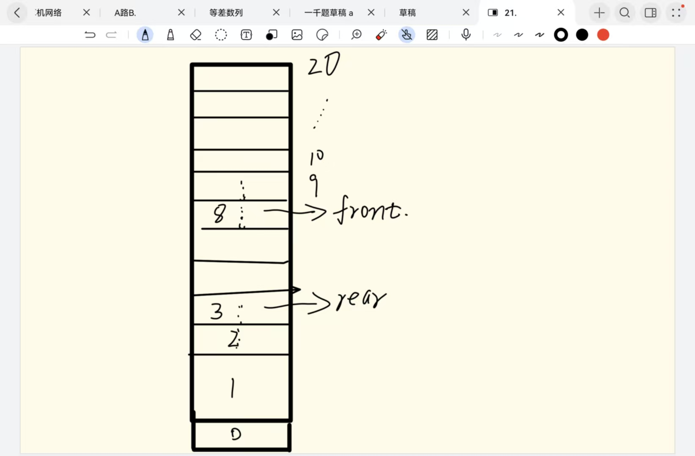
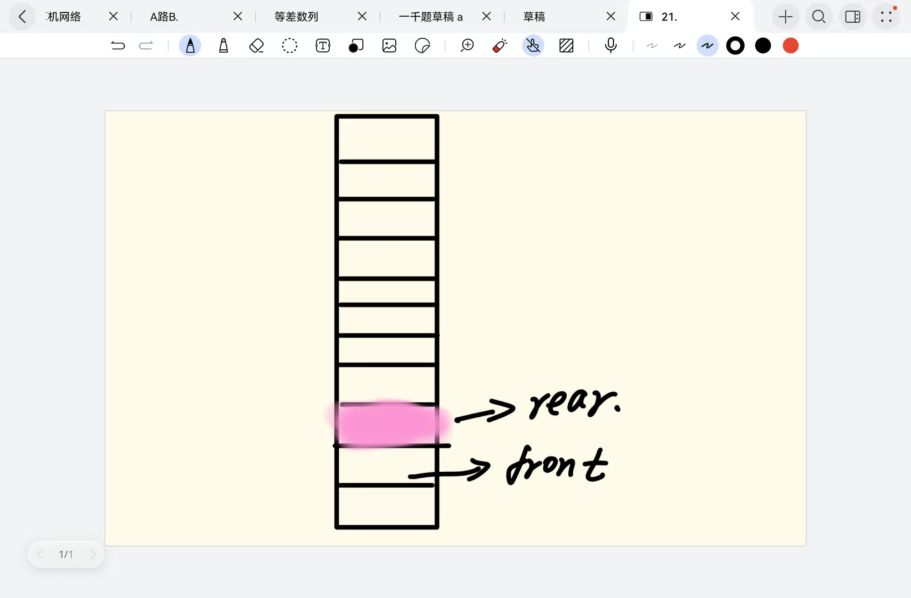
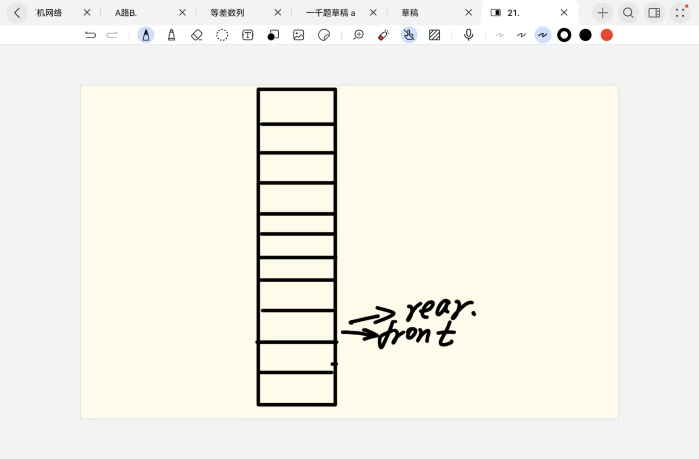
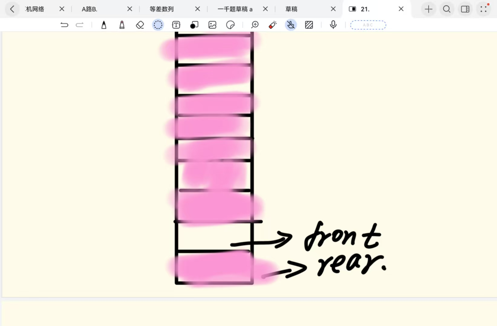

> 3.2.1 队列的基本概念

队列也是一种操作受限的线性表,只允许在队尾插入元素,在队头删除元素

插入元素的操作称为入队,删除元素的操作称为出队 其中最先入队的元素,最先出队First In First Out **FIFO**

队头front:允许删除的一端,又称为队首;

队尾rear:允许插入的一端;

空队列:不包含任何元素的表

队列常见操作:

- InitQueue(&Q):初始化队列,构建一个空队列Q
- QueueEmpty(Q):判断队列是否是空,如果是空则返回true
- EnQueue(&Q,x):向队尾插入元素x
- DeQueue(&Q,&x):从队头删除一个元素,用x返回
- GetHead(&Q,&x):获取队头的元素,用x返回

> 3.2.2 队列的顺序存储结构

//队列的顺序存储结构可以描述为:

```C
#define MaxSize 50
typedef struct {
    ElemType data[MaxSize];
    int front,rear;//front 和 rear 指向的是队列的队头和队尾的下标位置
}SqQueue
```

初始化时:Q.front = Q.rear = 0;

进队操作:如果队不满,先将值送到队尾,然后再让队尾指针+1

出队操作: 如果队不空,先取队头元素,再让队头指针+1;



这个图片中队尾指针已经到了9的位置,如果再+1 则就会出现数组下标越界的情况了,实际上队头已经出队元素,实际上这个队列并没有满,这个时候就可以使用==取模操作== 将队尾指针下一个位置变成0

队尾指针进一:Q.rear = (Q.rear+1) % MaxSize; 

队头指针进一:Q.front = (Q.front +1) % MaxSize

初始化:Q.rear = Q.front = 0;

队列长度 = (Q.rear -Q.front+MaxSize) % MaxSize

如果判断队列是否为空的话就是判断 是否 front == rear  如果队列满了的话 也就是下面这样



这个时候虽然队列还没有满,如果rear 再次进1 的话 则队尾就和队头指向了同一个位置,队初始化条件来说这个队列就是空的了,那么判断队列是否满的条件就是==rear 进一 是否等于front==

这样会空出一个位置无法放置元素;这种队列叫做循环队列

> 3.2.3 循环队列的操作

初始化:

```C
void InitQueue(SqQueue &Q){
    Q.rear = Q.front = 0;
}
```

判断队列空:

```C
bool QueueEmpty(SqQueue Q){
    if(Q.rear == Q.front){ //队空条件
        return true;
    }else{
        return false;
    }
}
```

元素入队:

```C
bool EnQueue(SqQueue &Q,&x){
    if((Q.rear+1) % MaxSize == Q.front){ //如果队尾指针的下一地址是front 则队伍满了
        return false;
    }
    Q.data[rear] = x;
    Q.rear = (Q.rear+1)%MaxSize
    return true;
}
```

元素出队:

```C
bool DeQueue(SqQueue &Q,&x){
	if(Q.rear = Q.front){//判断是否队空
		return false;
	}
	x = Q.data[Q.front];
	Q.front  = (Q.front+1) % MaxSize;
	return true;
}
```

如果要把空下来的元素利用起来的话则可以再原本的队列的结构中增加一个字段 tag 用来标记上一个操作是什么?

比如tag == 1代表入队

tag == 0 代表出队 初始值为0 

此时判断队空的条件则变成 front == rear 并且 tag == 0 (因为只有出队才可以让tag变为0)

判断队满的条件变成 front == rear 并且 tag ==1 (只有入队才可以让tag 变成 1)

```C
#define MaxSize 50
typedef struct {
    ElemType data[MaxSize];
    int front,rear;//front 和 rear 指向的是队列的队头和队尾的下标位置 其中队尾指针指向的时队尾元素的下一个应该插入的地址
    int tag == 0;
}SqQueue
```

元素入队:

```C
bool EnQueue(SqQueue &Q,&x){
    if((Q.rear+1) % MaxSize == Q.front && Q.tag == 1){ //如果队尾指针的下一地址是front 则队伍满了
        return false;
    }
    Q.data[rear] = x;
    Q.rear = (Q.rear+1)%MaxSize
    Q.tag = 1;
    return true;
}
```

元素出队:

```C
bool DeQueue(SqQueue &Q,&x){
	if(Q.rear = Q.front && Q.tag == 0){//判断是否队空
		return false;
	}
	x = Q.data[Q.front];
	Q.front  = (Q.front+1) % MaxSize;
    Q.tag = 0;
	return true;
}
```

**如果队尾指针指向的是队尾元素所在的位置,代码是否又会有变化?**

元素入队

```C
bool EnQueue(SqQueue &Q,&x){
    if((Q.rear+1) % MaxSize == Q.front && Q.tag == 1){ //如果队尾指针的下一地址是front 则队伍满了
        return false;
    }
    Q.rear = (Q.rear+1)%MaxSize
    Q.data[rear] = x;
    Q.tag = 1;
    return true;
}
```



此时队尾指针指向的是队尾元素,则需要先将队尾指针指向下一个元素的地址,然后再将新元素入队	

> 3.2.4 队列的链式存储结构

链式存储结构本质上还是一个链表,是一个同时拥有头指针和尾指针的单链表



链式存储类型可描述为:

```C
typedef struct { //链式队列结点
	ElemType data
	struct LNode * next;
}LNode
typedef struct {//链式队列
    Lnode *front,*rear; //队头指针以及队尾指针
}Link Queue;
```

链队列分为带头结点以及不带头节点,

**首先看下带头结点的操作**

初始化:

```C
void InitQueue(LinkQueue &Q){
    Q.front = Q.rear = (LNode *)malloc(sizeof(LNode));// 带头结点时,队尾指针和队头指针都指向第一个节点
   	Q.front->next = null;
}
```




初始化后如上图所示

入队:向队尾插入一个新结点 然后队尾的next指向null

```C
bool EnQueue(LinkQUeue &Q,ElemType x){
	LNode *s = (LNode *)malloc(sizeof(LNode));
	s->data = x;
	s->next = null;
	q.rear->next = s;//将s结点插入到当前链表的队尾
	q.rear = s; // 将队尾指向最新的队尾元素
    return true;
}
```

出队:从队头出去一个新元素,用x返回

```C
bool DeQueue(LinkQueue &Q,ElemType &x){
	//如果链表不为空则返回x 然后 将链表的头指向front->next;
	if(Q.front->next == null){//队列为空报错
		return false;
	}
	LNode *s = Q.front->next;
	x = s->data;
    Q.front->next = s->next;
    if(s = Q.rear){//如果删除的表里唯一一个元素,则将Q.rear 被释放后则 无法找到Q.rear
        Q.rear = Q.front;
    }
    free(s);
    return true;
}
```

**不带头结点的链队列实现:**

初始化: 初始化很简单,只需要将Q.rear 和Q.front 全部置为null即可

```C
void InitQueue(LinkQueue &Q){
	Q.front = Q.rear = null;
}
```

判断是否为空:

```c
bool isEmpty(LinkQueue &Q){
	if(Q.front == null){
		return true;
	}else{
		return false;
	}
}
```

新元素入队:

```C
bool EnQueue(LinkQUeue &Q,ElemType x){
	LNode *s = (LNode *)malloc(sizeof(LNode));
	s->data = x;
	s->next = null;
    if(Q.front == null){//如果是第一个元素入队的话则需要特殊处理下 将rear和front 都指向s即可
        Q.front = s;
        Q.rear = s;
    }else{
        q.rear->next = s;//将s结点插入到当前链表的队尾
		q.rear = s; // 将队尾指向最新的队尾元素
    }
    return true;
}
```

出队:

```C
bool DeQueue(LinkQUeue &Q,ElemType &x){
    if(Q.front == null){//空队
        return false;
    }
    LNode * s = Q.front;
    x = s->data;
    if(s == Q.rear){//如果删除的是最后一个元素
        Q.rear = Q.front = null;
    }else{
        Q.front = s->next;
    }
    free(s);
    return true;
}
```

链表不存在队列满的情况


队列重要知识点,回头复习的时候自己再推一遍

**已知循环队列的存储空间为数组A[21],front指向头元素的前一个位置,rear指向队尾元素,假设当前front 指针 和 rear指针的值分别为8和3,则该队列的长度为多少\_\_\_\_\_\_\_;**

```
分析:
A[21] 不是数组下标最大为21 而是A这个数组的长度就21,同时front 指向的是头元素的前一个位置,rear指向的是尾元素, 就代表了实际上从队头到队尾都是有元素的,然后也就是从8+1 个位置到最后21 个位置 然后再从21到第3个位置都是有元素,20-9+1 = 12个 然后 0,1,2,3三个位置是队尾的四个元素则,总共有12+4 = 16 个元素
```



**==注==** 

front 和 rear 肯定是朝着下标增大的方向移动的

就是这个意思，front 现在指向的是队头的前一个元素，如果要有元素出队，则front 一定会从8变成9 也就是有元素存在的位置，也就是front 增大的为止肯定是有元素存在，而rear 不同，rear 指向的是队尾元素，如果要有元素入队肯定是rear 先+1 然后再元素入队，也就是rear 增大的方向一定是 没有元素的位置（因为没有元素才可以元素入队）；如此则可以的得到问题的答案,从front 开始向后增，一直增到 rear 所在的为止都是有元素的。也就是 所谓的 **12+4 = 16**

**假设用数组Q[MaxSize]实现循环队列，队首指针指向队首元素的前一位置，队尾指针rear指向队尾元素，则判断该队列为空的条件是什么()**?

分析：这种题我们就假设队伍中只有一个元素，但是跟上一个题一样，要注意 **front 和 rear 都是朝着增大的方向移动的。**



此时rear 指向队尾元素，而front == 对头元素-1，现在这个队列中是有元素的，但是如果我要将这唯一的元素出队，我的front 指针就要向上移动一位，变成下面这样，此时判断队空的条件就变成了 rear == front 了



再看一题

**假设用A[0...n]实现循环队列,front,rear分别指向队头的前一个位置和队尾,判断该队列队满的条件是()?**

此题同上题:假设队伍中有一个元素


此时rear 指向的是队尾元素,并且题目中没有其他的辅助变量来辅助判断队空队满,则需要牺牲一个元素



此时就是队满的状态,也就是 **(rear + 1)% MaxSize 或者 (n+1) == front**

因为数组下标从0-n则总共有n+1元素 也就是maxsize = n+1