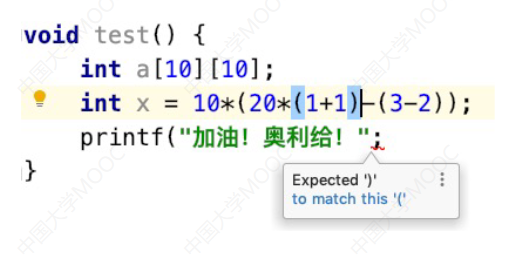
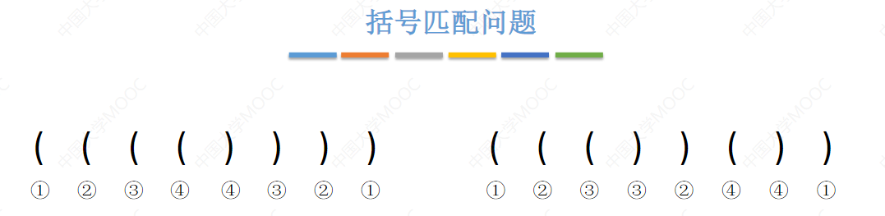
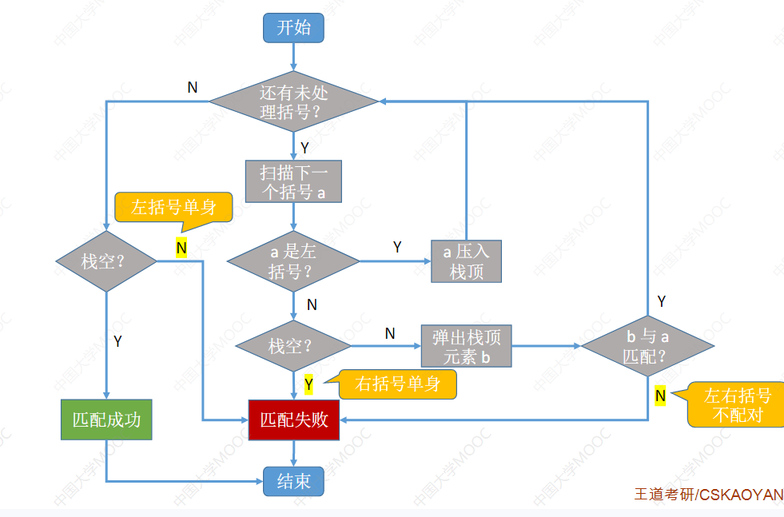
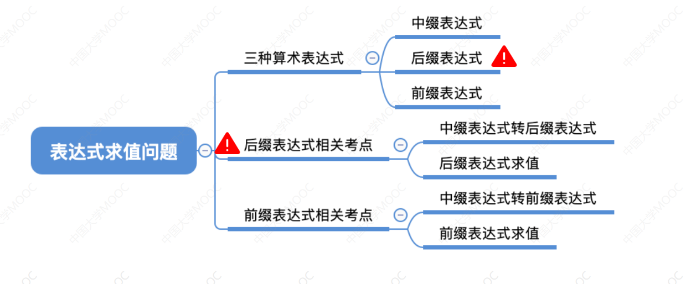
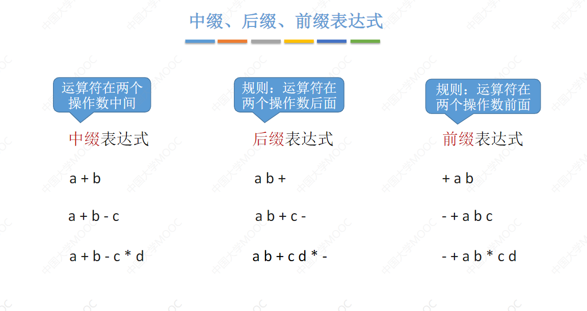
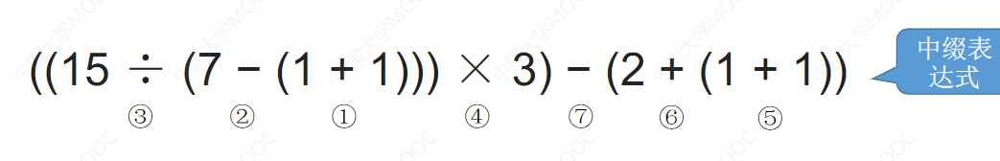
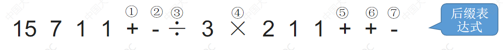
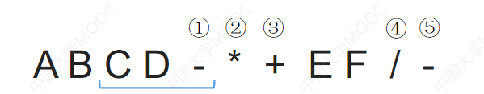

> 3.3.1 栈在括号匹配中的应用、



在编程中经常会有这种算数表达式 由于计算机不知道 乘除加减哪个优先级高，所以就要给一个表达式加上各种括号，如果点击一个括号，或者某个括号缺了它的另一半的话IDE可以给我们提示，这个是通过**栈的括号匹配**作用实现的、



这个问题可以表示为：

1. 从左向右开始扫描 如果遇到的是左括号则将它压入栈，如果扫描到的是右括号则将栈顶的左括号与之匹配。

## 	**流程图如下：**

1. 

栈的定义

```C
#define MaxSize = 10;
typedef struct {
    ElemType data[MaxSize];
    int top;
}SqStack
```

栈的基本操作：

```C
void InitStack(Sqstack &S)
bool StackEmpty(Sqstack S)
bool Pop(SqStack &S,ElemType &x)
bool Push(SqStack &S)
```


括号匹配代码实现：

```C
bool bracketCheck(char str[],int length){
    //初始化顺序栈
    SqStack s = SqStack s;
    s.top = -1;
    char bracket,topElem;
    for(int i  = 0; int i < length;i++){
        bracket = str[i];
        //依次取出字符中的括号，然后判断是否是左括号，如果是左括号就入栈
        //如果是右括号则从栈中取出一个括号与之匹配，如果不是左括号，或者栈空则匹配失败
        if(bracket == "(" || bracket == "{" || bracket == "["){
            s.top++;
            s.data[s.top] = bracket;
        }else{//如果当前是右括号而且栈中括号 就匹配失败
            if(s.data[top] == null){
                return false;
            }
            //元素出栈
            topElem = s.data[s.top];
            S.top--;
            if(bracket == "(" && topElem != "(" ){
                return false;
            }
            if(bracket == "{" && topElem != "{" ){
                return false;
            }
            if(bracket == "[" && topElem != "[" ){
                return false;
            }
        }
    }
    return isEmpty(s);//如果匹配完所有的括号 栈空则表示匹配完成
}
```

用栈实现括号匹配：
依次扫描所有字符，遇到左括号入栈，遇到右括号则弹出栈顶元素检查是否匹配。
匹配失败情况：
①左括号单身②右括号单身③左右括号不匹配

> 3.3.2 用栈来解决算数表达式求值问题




三种算数表达式：



中序表达式就是我们平时看到的那种将**操作符写到两个操作数中间**

后缀表达式就是将**操作符写到两个操作数的后边** **==逆波兰表达式==**

顾名思义，前缀表达式就是：**操作符写到两个操作数的前边**** **==波兰表达式==**

#### 中缀表达式转后缀表达式（手算）

① 确定中缀表达式中各个运算符的运算顺序
② 选择下一个运算符，按照==「左操作数 右操作数 运算符」==的方式组合成一个新的操作数
③ 如果还有运算符没被处理，就继续 

例如：



按照“先算乘除，后算加减，有括号先算括号里面的” 这个规则来进行确定各个运算符的操作次序

按照操作符的次序来进行转换后缀表达式

==只要左边的运算符能先计算，就优先算左边的====**这个非常重要**== 

**为了保证手算和机算结果相同 “左优先”原则** ------》中缀转后缀

转换后的后缀表达式就是



> 后缀表达式的计算（手算）

- 从左向右扫描，每遇到一个运算符就将离运算符最近的两个操作数执行对应的运算
- 例如：
  - 
  - **A+(B*(C-D))  - (E/F)**

> 后缀表达式的计算 （机算）

用栈实现后缀表达式的计算：

1. 从左向右依次扫描表达式；
2. 如果扫描到操作数，则入栈
3. 如果扫描到运算符，则从栈中弹出两个操作数执行对应的操作，再入栈	

对于上诉的例子，栈的操作就是，

从左向右依次扫描遇到A、B、C、D依次入栈，此时栈中从栈顶到栈底的元素依次为

- D
- C
- B
- A

然后遇到运算符“-” 弹出两个栈顶元素，依次弹出栈顶元素D,C,==**先出栈的是右操作数**== 于是得到(C-D) 压入栈中;

此时栈中元素为

- (C-D)
- B
- A

扫描到运算符"*" 弹出两个栈顶元素,然后依次弹出(C-D),B 得到(B\*(C-D)) 压入栈中

此时栈中元素

- (B\*(C-D)) 
- A

继续扫描到运算符"+" 弹出两个栈顶元素,依次弹出(B\*(C-D)) ,A 得到 ( A + (B\*(C-D)) ),压入栈中

此时栈中元素

- ( A + (B\*(C-D)) )

然后遇到E,F 压入栈中,扫描到运算符/ 弹出EF 进行运算得到 (E/F) 压入栈中

此时栈中元素

- (E/F)
- ( A + (B\*(C-D)) )

此时遇到最后一个运算符 "-" 弹出两个操作数来进行运算的到 ( ( A + (B\*(C-D)) ) - (E/F) ) 压入栈中

此时栈中元素

-  ( ( A + (B\*(C-D)) ) - (E/F) )

扫描完毕后则将栈中元素PUSH出来得到结果