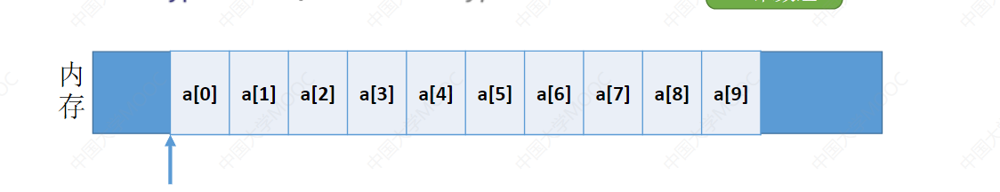
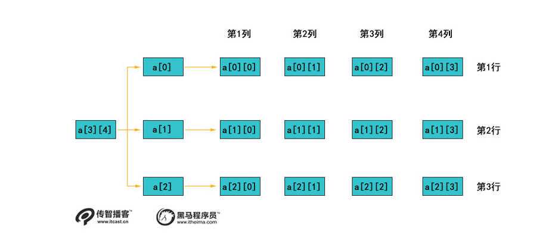

> 数组和特殊矩阵

#### 数组的存储结构

​	数组的所有元素在计算机内存中占用一片连续的空间存储 又由于数组的每个元素的类型都是相同的,所以数组可以做到随机存储的效果;

​	怎么实现的呢: 假设 我们数组的起始地址为LOC 然后 我如果要取第i个元素的话,可以通过公式直接得到第i个元素的起始地址

假设我要去a[9] 这个元素,则可以看到a[9] 是 这个数组的第十个元素,现在 我们知道数组的起始地址,则可以让起始地址向后移动i个元素来找到a[9]的起始地址.也就是如下公式:

​						**LOC + i * sizeof(ElemType)**

**如果数组下标是从1开始**的话我们的a[9]元素就变成了a[10];

则如果我要找到a[10]的起始地址 也是 将 LOC起始地址向后移动i个元素 不过由于数组下标是从1开始的,从第1个元素到第10个元素中间只需要移动9个位置即可得到第10个元素的起始位置则上述公式则变成

​						**LOC + (i-1) * sizeof(ElemType)**

## **假如是一个二维数组呢?**

二维数组我们知道如果将一维数组看作一行元素的话,则二维数组就是多行元素,假设有个三行四列的二维数组 如下图这个样子

那么这样一个二维数组是怎么存放在内存中呢?

二维数组的存放其实也是将二维数组每一行的头尾相接,或者每一列的头尾相接,在内存中连续存放的.

## 如果按照行优先的存储二维数组:

| a\[0]\[0] | a\[0]\[1] | a\[0]\[2] | a\[0]\[3] | a\[1]\[0] | a\[1]\[1] | a\[1]\[2] | a\[1]\[3] | a\[2]\[0] | a\[2]\[1] | a\[2]\[2] | a\[2]\[3] |
| :-------: | :-------: | :-------: | :-------: | :-------: | :-------: | --------- | :-------: | :-------: | :-------: | :-------: | :-------: |

也就是依次按照行来存放,如果在行优先的情况下我要找第a\[i]\[j]个元素的话.我就需要这么找:

这个二维数组每行元素有四个,首先i代表行数,j代表列数 数组下标是从0 开始,数组的起始地址为

i代表 这个元素在数组中是第i+1行,也就是该数组前面有i-1 行的元素,然后j代表 他是该行第j列的元素,又由于数组下标是从0开始,则他在内存中的位置为

**(i* 列数 + j) * sizeof(elemType)**

故 a\[2]\[3] 的计算公式为 第3行第3列

**LOC+ (i*4 +j) * sizeof(ElemType);**

**LOC + (2*4+ 3) * sizeof(ElemType)**

如果数组下标从1开始的话,
| a\[1]\[1] | a\[1]\[2] | a\[1]\[3] | a\[1]\[4] | a\[2]\[1] | a\[2]\[2] | a\[2]\[3] | a\[2]\[4] | a\[3]\[1] | a\[3]\[2] | a\[3]\[3] | a\[3]\[4] |
| :-------: | :-------: | :-------: | :-------: | :-------: | :-------: | --------- | :-------: | :-------: | :-------: | :-------: | :-------: |

则a\[i]\[j]个元素的起始地址就变成了

**([i-1]*4 + j) * sizeof(elemType)**

此时 a\[2]\[3] 的计算公式为 第2行第3列

**LOC + (1*4+ 3) * sizeof(ElemType)**

### 按照列优先来存储二维数组

如果按照列优先原则 在内存中的存储变成了这样 
| a\[0]\[0] | a\[1]\[0] | a\[2]\[0] | a\[0]\[1] | a\[1]\[1] | a\[2]\[1] | a\[0]\[2] | a\[1]\[2] | a\[2]\[2] | a\[0]\[3] | a\[1]\[3] | a\[2]\[3] |
| :-------: | :-------: | :-------: | :-------: | :-------: | :-------: | --------- | :-------: | :-------: | :-------: | :-------: | :-------: |

如果我想要在这个内存中找到a[i]\[j]的元素的话,j代表当前元素在j+1列.

a[i]\[j]的起始地址 =  **LOC+ (j*列数 +i  )  * sizeof(ElemType)**

而如果数组下标从1开始 

**a[i]\[j]的起始地址 = LOC+((j-1) * 列数 + i -1  )  * sizeof(ElemType)**

