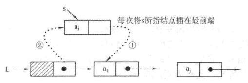

> 线性表的顺序表示和实现

线性表的链式存储又被称为链表，链表和顺序表不同的地方是，顺序表的每一个节点在内存中都是相邻的，但是链表每个节点在物理位置上不相邻，每个节点使用指针指向自己节点的下一节点

**单链表的特点：**

1. 单链表不要求逻辑上相邻的两个元素在物理位置上也相邻，因此不需要连续的存储空间。
2. 单链表是非随机的存储结构，即不能直接找到表中某个特定的结点。查找某个特定的结点时，需要从表头开始遍历，依次查找。

**单链表的定义**

```C
typedef struct LNode{
	ElemType data;
	struct LNode * next;
}LNode,* LinkList; 
```

单链表的一些基础操作

**初始化单链表**：void InitLinkList(LNode &L);

```C
void InitLinkList(Lnode &L){
    L = (LNode *)malloc(sizeof(LNode));
    L->next = null;
}
```

```C
void InitLinkList(Lnode &L){ //不带头结点初始化
    L = NULL;
}
```

这一步的操作就是初始化一个带头结点的单链表，其中L是链表的第一个结点，讲第一个结点的next 指向NULL 就完成了初始化，如果链表不带头结点的话，就将L直接指向NULL即可，不过一般为了方便还是都是带头结点。


<hr/>

建立单链表:建立单链表分为**头插法**和**尾插法**

**头插法建立单链表**：

算法思想：头插法的思想是这样，首先初始化一个单链表，单链表L指向NULL 然后 声明一个新结点p p的next 指向的是L->next，然后再讲L->next指向p



```C
LinkList HeadInsert(LinkList &L){
	InitLinkList(L);
    int i = 99;
    while(i){
        LNode * p = (LNode *)malloc(sizeof(LNode));
        p->data = i;
        p->next = L->next;
        L->next = p;
        i--;
    }
}
```

**尾插法创建单链表**

算法思想:尾插法思想是这样,找到链表L的最后一个结点r然后使L的最后一个结点的next指向新的结点p,然后移动r指针到队尾

```C
LinkList TailInsert(LinkList &L){
	InitLinkList(L);
    LNode * r= (LNode *)malloc(sizeof(LNode));
    r = L;
    int i = 1;
    while(i<100){
        LNode * p= (LNode *)malloc(sizeof(LNode));
        p->data = i;
        r->next = p;
        r = p
        i++;
    }
}
```

**遍历单链表并输出**：

思想：声明一个指针P，然后不断的将L的next赋值给p 直到访问到最后一个元素结束（结束条件p==NULL）

```C
void Visit(LinkList &L){
    LNode * p = (LNode *)malloc(sizeof(LNode));
    p = L->next;
    while(p){
        cout<<p->data;
        p = p->next;
    }
    cout<<end;
}
```

**求单链表的长度**

算法思想：类似于遍历单链表，但是多声明一个变量记录链表长度

```C
int getLength(LinkList &L){
    LNode * p = (LNode *)malloc(sizeof(LNode));
    p = L->next;
    int i = 0;
    while(p){
        i++;
        p = p->next;
    }
    return i;
}
```

 **按值查找**

算法思想:从单链表的第一个结点开始,依次比较表中各个结点的数据域的值,若某结点的值等于e,则返回该结点的指针,如果没有这个结点就返回NULL

```C
LNode* locateElem(LinkList &L,ElemType e){
    LNode * p = (LNode *)malloc(sizeof(LNode));
    p = L->next;
    while(p && p->data != e){
        p= p->next;
    }
    return p;
}
```

**按位查找**

算法思想:定义一个计数器j,记住找到了哪个位置的,如果循环结束后j 仍旧小于i 则说明 链表长度不够返回报错即可.

```C
LNode* GetElem(LinkList &L,int i){
    LNode * p = (LNode *)malloc(sizeof(LNode));
    p = L->next;
    int j = 1;
    while(p&&j<i){
        p = p->next;
        j++;
    }
    if(p==null || j<i){
        return ERROR;
    }
    return p;
}
```

**插入结点**

算法思想:在第i个位置插入结点p 首先要找到第i-1个元素,然后结点p的next 指向 第i个元素,第i-1个元素的next指向p

```C
void InsertNode(LinkList &L,int i,ElemType e){
    LNode * p = GetElem(L,i-1);
    LNode * q = (LNode *)malloc(sizeof(LNode));
    q->data = e;
    q->next = p->next;
    p->next = q;
}
```

**删除结点**

算法思想:找到第i-1个结点,然后讲i-1的元素的next 指向 他的next的next 然后释放第i个结点

```
void delete(LinkList &L,int i){
	if(i<1 || i>Length(L)){//检查i的合法性
		return ERROR
	}
    LNode * p = GetElem(L,i-1);
    LNode * q = (LNode *)malloc(sizeof(LNode));
    q = p->next;
    p->next = q->next;
    free(q);
}
```

> 2.3.4 循环链表

循环链表是根据单链表改进的，原本单链表的最后一个节点的next指针指向的是NULL 单链表的如果要查找最后一个元素的时间复杂度为O(n);  如果一个场景经常需要对链表的最后一个结点来操作的话，就可以使用循环链表，使用一个尾指针r 指向链表的尾结点，然后r->next 就是头节点，这样的操作最后一个节点和第一个节点的时间复杂度都是O(1)适合频繁操作头节点和尾结点的场景

双链表：双链表就是在单链表的基础上加上一个prior指针指向一个结点的上一个元素，假如我想要删除当前节点p

只需要3步：

```c
// 调整前驱节点的next（如果存在前驱）
if (p->prior != NULL) {
    p->prior->next = p->next;
}
// 调整后继节点的prior（如果存在后继）
if (p->next != NULL) {
    p->next->prior = p->prior;
}
free(p);
```

循环双链表：

循环双链表跟普通的双链表不同的是：头节点的prior指向的是链表的尾结点，而尾结点的next 指向的是结点的头节点

>  双链表的插入操作：


**双向链表的插入**:

①s->prior = p->prior

②p->prior->next = s；

③s->next = p;

④p->prior = s;

**双链表的删除：**


①p->prior->next = p->next;

②p->next->prior = p->prior;

③free(p);

单链表，循环链表，双向链表的时间复杂分析

|                                          | 查找头节点         | 查找表尾结点         | 查找*p的前驱结点                     |
| ---------------------------------------- | ------------------ | -------------------- | ------------------------------------ |
| 带头节点的**单链表**                     | L->next <br />O(1) | 依次遍历直到表尾O(n) | 无法找到前驱找到表尾后无法从头开始查 |
| 带头结点仅设置**头指针**的**循环单链表** | L->next <br />O(1) | 依次遍历直到表尾O(n) | L->next依次循环直到找到前驱O(n)      |
| 带头结点仅设置**尾指针**的**循环单链表** | R->next<br />O(1)  | R<br />O(1)          | R->next 依次查找直至找到O(n)         |
| 带头结点的**双向循环链表**               | L->next <br />O(1) | L->prior<br />O(1)   | 直接L->prior找到前驱                 |

