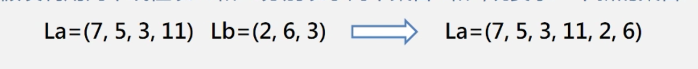
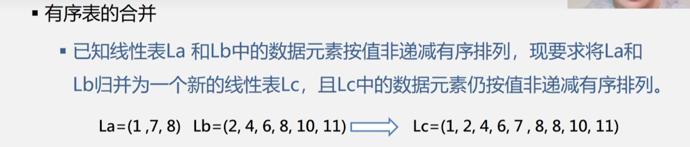
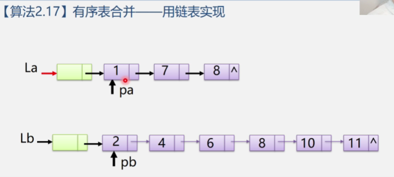
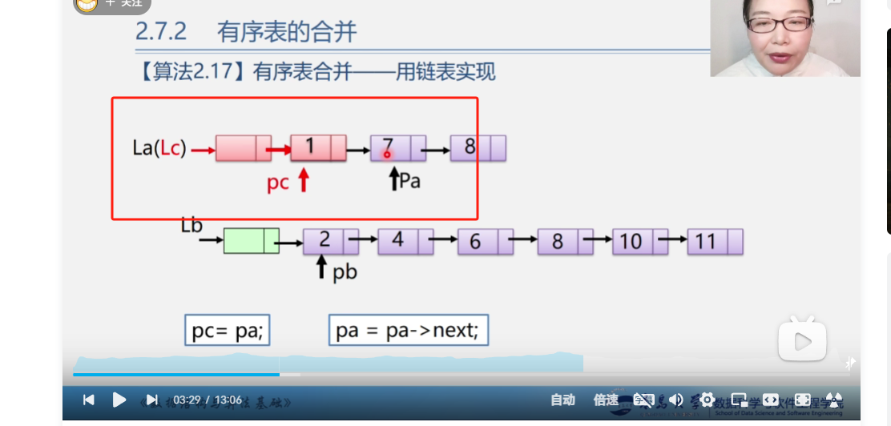

> 2.4.1 线性表的合并

问题描述：假设利用两个线性表La，Lb分别表示集合A，B现在要求一个将两个集合合并然后加入一个到A中

去掉多余的元素



la和lb中两个"3"只需要保留一个3即可

算法步骤:

**依次取出Lb中的元素**,执行如下操作:

①看是否La中存在该元素

②如果没找到就将该元素插入La的最后

//代码如下

```c
void union(List &La,List Lb){
    len_la = length(la);
    len_lb = length(lb); 
    for(int i = 1;i<len_lb;i++){//循环依次找出Lb中的元素
        getElem(Lb,i,e);//获取lb中第i个元素
        if(!locateElem(La,e)){//如果la中没找到元素的话就插入该元素
            insertList(La,++len_la,e);
        }
    }
}
```


> 2.4.2 有序表的合并 用**顺序表**实现



算法步骤如下	

①创建一个空表 Lc

②依次从La或者Lb中 获取较小的节点插入Lc中 直到某一链表为空

③然后将另外一个链表的所有加入到Lc中

```C
void Merge(SqList La,SqList Lb,SqList &Lc){
    pa = La.elem;
    pb = Lb.elem;
    Lc.length = La.length+Lb.length; //Lc 的长度等于两个表的长度相加
    Lc.elem = (SqList) malloc(sizeof(SqList * Lc.length));
    pc = Lc.elem; //指针pc指向Lc的第一个元素
    Pa_last = La.elem + La.length -1 // Pa_last指向 pb 最后一个元素
    Pb_last = Lb.elem +Lb.length - 1 //Pb_last 指向pb最后一个元素
    while (pa <= pa_last && pb<= pb_last){//如果某个链表走到最后则停止循环
        if(*pa <= *pb) { //如果pa比pb小则将pa当前元素写入pc 否则就是将pb写入pc
            *pc++ = *pa++
        }else{
            *pc++ = *pb++;
        }
    }
    //这一步是为了检查两个链表中没走完的一个一次写入pc
    while(pa <= pa_last){
        *pc++ = *pa++;
    }
    while(pb <= pb_last){
        *pc++ = *pb++
    }
}
```

> 2.4.3 有序表的合并  **链表**实现



要使用链表将两个链表进行合并,则不需要新创建一个链表Lc 可以任意选择一个已有的链表来进行当作新链表



然后将pa 和pb 分别指向链表La,Lb的第一个结点依次遍历比大小较小的结点向后移动指针,将指针pc指向较小结点,然后将较大的结点接入较小的结点后面,

具体代码实现如下:

```c
void Merge(LinkList La,LinkList Lb){
    pa = La->next;pb= Lb->next;
    pc = pa; //现在pa 和 pb 分别指向两个链表的第一个结点
    Lc = pc = La;//用La的头结点作为Lc的头节点
    while (pa && pb){
        if(pa->data <= pb->data){
            pc->next = pa;
            pc = pa;
            pa = pa->next;
        }else{
            pc->next = pb;
            pc = pb;
            pb = pb->next;
        }
    }
    if(pa){
        pc->next = pa->next;
    }else{
        pc->next = pb->next;
    }
    free(lb);//释放Lb的头节点
}
```

