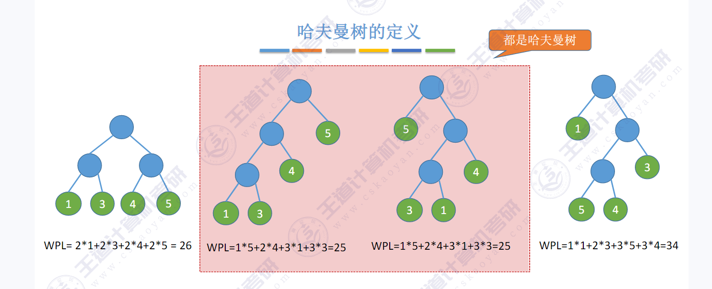

> 哈夫曼树和哈夫曼编码

路径:从一个节点到另外一个结点的之间的边叫做路径

路径长度就是 从一个节点到另外一个节点经过的节点的个数

很多时候书中的结点被赋予一个表示某种意义的值,这个被称作结点的权

**带权路径长度**: 从根到该结点经过的边的条数 乘 该结点的权值的乘积 被称为该结点的**带权路径长度(WPL)**

树总所有的**叶结点**的带权路径长度的和被称为这个**树的带权路径长度**

其中 带权路径长度最小的 树 被称为哈夫曼树;



②,③两个树 的 WPL 都是最小 25 这两颗树都是哈夫曼树. 哈夫曼树可以不唯一

> 怎么构建一个哈夫曼树?

1. 设有n个结点,从中选择两个权值最小的结点 变成一颗只有两个叶结点的二叉树,这个二叉树的根节点的权值就是两个结点的和
2. 然后将这个根节点放回n结点的集合中去.再重复1的操作
3. 直到集合中只剩下一棵树为止;

###### 哈夫曼树的性质

1. 哈夫曼树 中 有2n-1个结点
2. 权值越小的结点到根节点的路径长度越大
3. 哈夫曼树中不存在度为1的结点

**哈夫曼编码**

如果对每个字符用相等长度的二进制位表示,则称这个编码方式为**固定长度编码**

如果对不同的字符用不等长的二进制位表示,则称这个编码方式为**可变长度编码**


如果没有一个编码是另外一个编码的前缀,则称这样的编码是**前缀编码**

举例:

1. 设计字符A,B,C对应的编码0,10,110是前缀编码 

   这样设计的编码可以很快的识别出来,因为没有一个编码是另外一个编码的前缀. 例如:0010110可以识别为AABC

​	可以使用二叉树来设计二进制前缀编码.假设为A,B,C,D四个字符设计前缀编码.可以用下列的二叉树来表示:

```c
        ⚪
       /  \
      A    ⚪
      	   / \
      	  B   ⚪
      	      / \
      	     C   D
```

每个叶结点分别代表一个字符,且如果约定左分支为0,右分支为1的情况下;

A,B,C,D的编码分别为 0,10,110,111 

使用二叉树来构造前缀编码并没有对左分支是0还是1做出任何约定

> **并查集**

// todo 