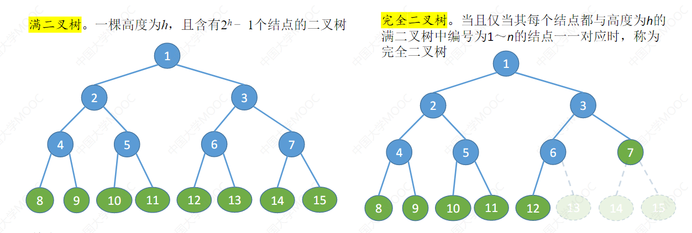

> 5.2 二叉树的概念

#### 二叉树的定义

​	二叉树是一种特殊的树,他的特点是 每个结点至多两个子树.

二叉树的五种基本形态:

- 空二叉树
- 只有根节点
- 只有左子树
- 只有右子树
- 左右子树都有

**满二叉树**

​	一个高度为h的二叉树,如果他的结点个数为:2^h^-1则就称为满二叉树,满二叉树的叶子结点都集中在最下面一层,除了叶结点外所有的节点的度均为2.

**完全二叉树:**

​	完全二叉树:高度为h,具有n个结点的二叉树,并且仅当每个节点都与高度为h的满二叉树中编号为1~n的结点一一对应则称为满二叉树,如果把空缺的位置填上相应序号的结点 则变成满二叉树

设i为某个结点的编号,则 左孩子的编号为 2i 右孩子的编号为 2i-1.则他的父结点为 i/2 (向下取整) 

**对于完全二叉树来说若i<= [n/2] 向下取整  则i为分支结点,否则为叶结点. 叶结点只可能出现在最后两行,并且度为1的结点有且只能有一个**

## 二叉树的性质:

​	非空二叉树的叶结点的个数等于度为2的结点的个数+1 

​	首先  n = 度为0的结点+ 度为1 的结点 + 度为2 的结点.

- ​	n = N^0^+N^1^+N^2^;	

​	其次二叉树的边E和结点数n的关系为E = n -1 (除了根节点之外每个结点都有一条边连向父节点)

​	从结点的度来出发,度为1 的结点贡献了1条边,度为2的结点贡献了两条边,边的个数E = N~1~ + 2N~2~

​	于是E = E 

​	(N~0~+N~1~+N~2~;)n - 1 =  N~1~ + 2N~2~

​	则N~0~ = N~2~ + 1;

- ​	非空二叉树的第k层最多有 2^k-1^ 个结点
- 高度为h的二叉树最多有 2^k^-1 个结点