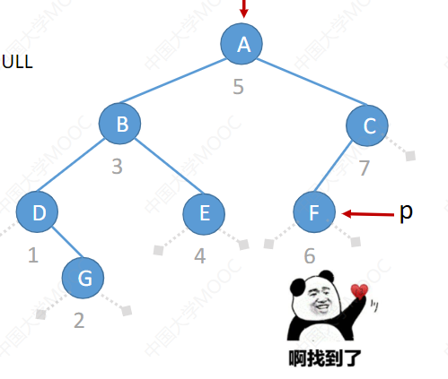
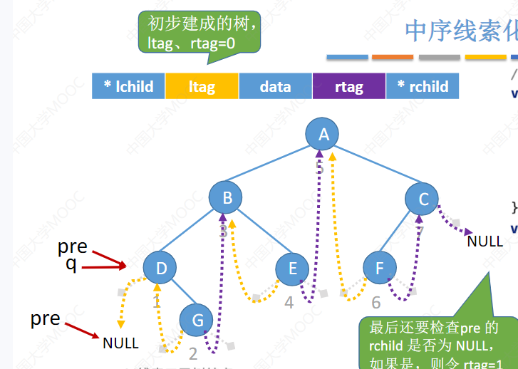
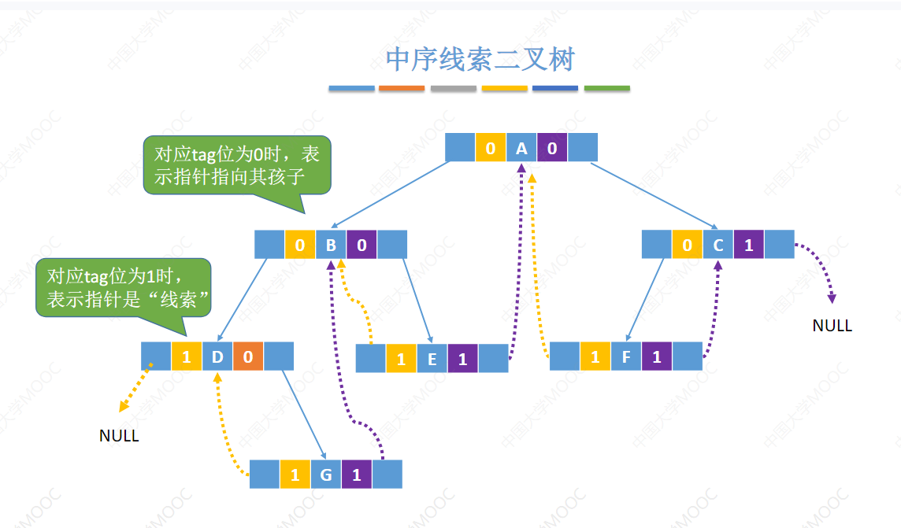
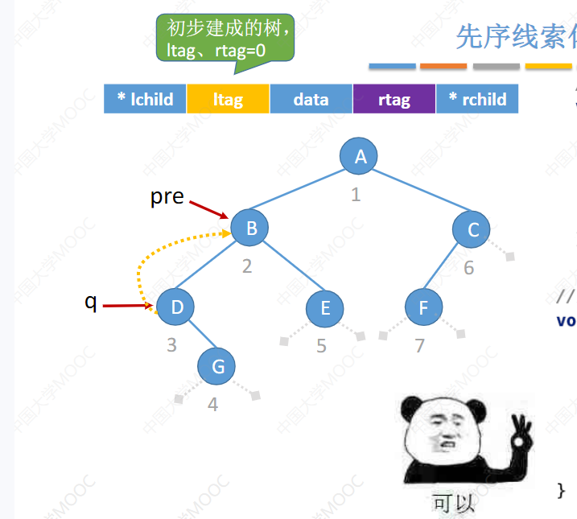

> 线索二叉树

什么是二叉树的线索化?为什么要进行二叉树的线索化?

首先线索化二叉树是针对二叉树的遍历来的，不同的遍历序列线索化后的二叉树不一样

因为传统的二叉链表只能表示出来一种父子关系，不能直接得到该节点的前驱或者后继， 我们线索化二叉树就是为了找到这个结点的对应遍历序列的前驱结点和后继结点。又由于 n个节点的二叉树 有 n+1个空指针域。**把这n+1个空指针指向结点的前驱和后继的线索**

对原来的二叉链表进行改造，新增ltag，rtag两个标志将其改造为线索二叉树。

> 中序二叉树的构造

```C
typedef struct ThreadNode{
    ElemType data;
    struct ThreadNode * lchild,* rchild; // 左右孩子指针
    int ltag,rtag;  //线索标志 如果tag值为1 则代表这个结点的左右孩子指针指向的是线索
}
```

1. 首先将一个二叉树进行中序遍历  **手算方式**

   1. 以下图为例

      1. 
      2. 首先先将这个二叉树按照中序遍历的访问，如果左指针为空，则让左指针指向前驱，如果右指针为空则让它指向后继。按照这个样子线索化后的二叉树就长下面这个样子
      3. 

   2. 代码实现树的中序线索化：

      ```C
      //全局变量
      ThreadNode *pre  = NULL //pre指向当前遍历到的结点的前驱
      ```

      ```C
      void visit(ThreadNode &p){
      	if(p!=NULL){
      		if(p->lchild == NULL){
      			p->lchild = pre;
      			p>ltag = 1;
      		}
      		if(pre != null && pre->rchild == NULL){
      			pre->rchild = p;
      			pre->rtag = 1;
      		}
      		pre = p;
      	}
      }
      ```

      ```C
      //中序遍历二叉树，一边遍历 一遍线索化。
      void InThread(ThreadTree &p){
      	if(p!=NULL){
              InThread(p->lchild);
              visit(p);
              InThread(p->rchild);
          }
      }
      ```

      ```
      //创建线索二叉树
      void CreatInThread(ThreadTree T){
      	if(T != NULL){
      		InThread(T);
      		if (pre->rchild == NULL){ //处理最后一个结点
      			pre->ltag = 1;
      		}
      	}
      }
      ```

      

先序线索化和后序线索化

同上，这里只给出 visit和InThread函数的变化

```C
//先序线索化
void PreThread(ThreadTree &p){
	if(p!=NULL){
        visit(p);
            //这一步为了干啥  先序线索化为啥需要判断一下？ltag 是否为 0；
        	if(p->ltag == 0){
                InThread(p->lchild);
            }
        InThread(p->rchild);
    }
}
```

上面有一行代码 判断了 ltag 是否等于0  

这一步是为了干啥呢？

拿这个图片举例



我们对这个二叉树 进行 先序线索化，D这个结点是第三个被访问到，然后它的左指针是空的，ok 将它顺理成章的指向pre 也就是前驱结点，当遍历完D这个结点后，我就需要遍历D的左孩子，也就是lchild 如果这样我又回到了B这个结点，所以在D这个地方判断下是否他的左指针被线索化了，如果是左孩子就正常遍历，如果是线索则不遍历。同时，我们处理完最后一个结点后也需要判断最后一个节点的指针是否指向NULL

```
//创建先序线索二叉树
void CreatPreThread(ThreadTree T){
	if(T != NULL){
		InThread(T);
		if (pre->rchild == NULL){ //处理最后一个结点
			pre->rtag = 1;
		}
	}
}
```

 后序遍历同上

只需要更改创建创建完成之后的更改最后一个结点的右指针指向NULL即可,**==不存在先序遍历的环路问题==**

```
//创建线索二叉树
void CreatPostThread(ThreadTree T){
	if(T != NULL){
		InThread(T);
		if (pre->rchild == NULL){ //处理最后一个结点
			pre->ltag = 1;
		}
	}
}
```

