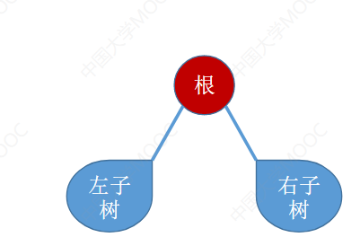
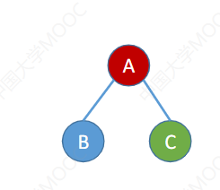
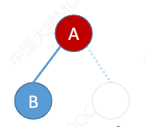
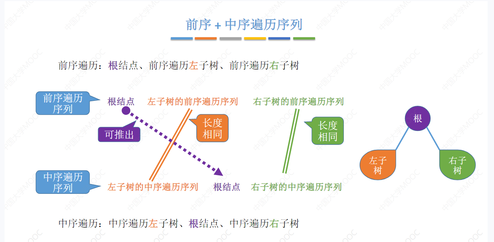
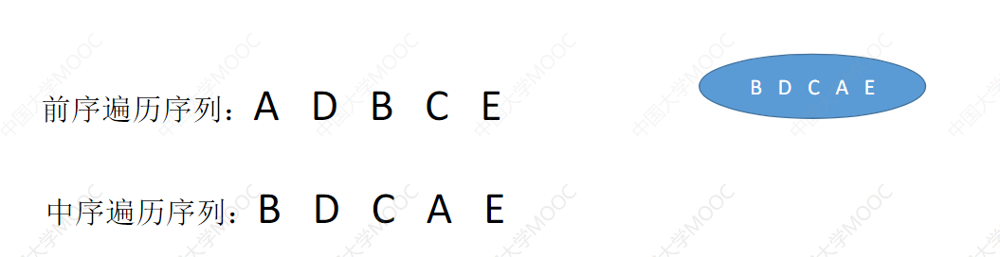
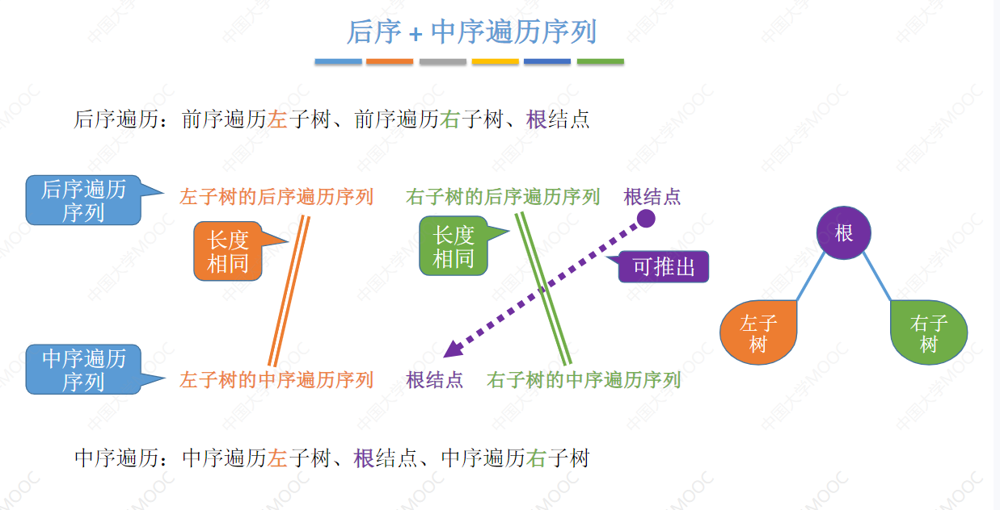
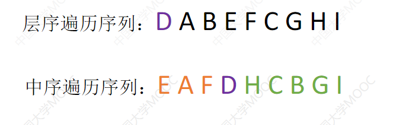

> 5.3 二叉树的先/中/后序 遍历

遍历：按照某种次序把所有结点都访问一遍

**首先先看下二叉树的基本结构**



- 先序遍历则是根据 根左右的次序依次遍历二叉树
- 后序遍历则是 根结点最后遍历,然后先遍历左子树再遍历右子树
- 中序遍历是 先左子树,再根结点,再右子树
- 
- 例如这个二叉树 如果分别按照 三个遍历次序来遍历会得到
  - 先序遍历 A B C
  - 中序遍历 B A C
  - 后序遍历 B C A
- 
- 这个右子树为空的情况下 
  - 先序遍历
    - A B
  - 中序遍历
    - B C
  - 后序遍历
    - B A

三种遍历的代码实现:

首先我们二叉树的数据结构

```C
typedef struct BiTNode{
	ElemType data'
	BiTNode * lchild,* rchild;
}BitNode,*BiTree
```

先序遍历:

```C
void PreOrder(BiTree T){
	if(T != NULL){
        //先访问根节点,然后左结点 右结点
        visit(T);
        PreOrder(T->lchild);
        PreOrder(T->rchild);
    }
}
```

后序遍历:

```C
void PreOrder(BiTree T){
	if(T != NULL){
        //左  右  根
        PreOrder(T->lchild);
        PreOrder(T->rchild);
        visit(T);
    }
}
```

中序遍历:

```C
void PreOrder(BiTree T){
	if(T != NULL){
        //左  根 右
        PreOrder(T->lchild);
        visit(T);
        PreOrder(T->rchild);
    }
}
```

**todo 非递归算法进行遍历二叉树**


由遍历顺序构造二叉树

根据 中序遍历、后序遍历、前序遍历、层序遍历中单一的某个次序 不能确定二叉树的形状，

但是 中序遍历+任意一种遍历次序就可以确定唯一的一颗二叉树

1. 由中序遍历+前序遍历构建二叉树

   1. 由于前序遍历，每个结点的根节点往往是第一个结点，而中序遍历中的左结点在根结点的左边，右结点在根结点的右边这样就可以确定一个二叉树。

   2. 

   3. 

   4. 假设有一颗二叉树的前序遍历和中序遍历的序列如上图

   5. 由于前序遍历的特点可以知道  A 一定是这个二叉树的根节点，同时由于中序遍历的特点 BDC 一定是在A的左子树，那么我们就可以得到一个树的基础的形状。 同时我们又知道在BDC 中 D 在前序遍历中的第一个遍历的 则 D 是一个根节点 B C 分别是他两个左子树 和 右子树

   6. ```
      	     A
      	   	/ \
      	  DBC 	E
        	D
         / \
        B   C
       //二叉树最终形状
      ```

2. 由中序遍历+ 后序遍历构建二叉树

   1. 

   2. 后序遍历的遍历顺序是 左  右 根 根节点是最后访问到的 如果结合 中序遍历就跟前序遍历一样，无非前序遍历从前往后找根结点 后序遍历从后往前找根节点罢了

      1. 直接上练习

      2. 

      3. ```C
         //这个后序遍历 最后一个结点是 D 则D 为根节点
         									D
                                            / \
                                        EAF     HCBGI //EAF 中 A 在后序遍历最后出现 A为根节点 HCBGI 中B最后出现B为根节点
                                    	   /        \
                                       A          B
                                      / \         / \
                                     E   F      HC   GI   //HC 中 C 是根节点 GI G是根节点
                                                /      \
                                               C        G
                                              /          \
                                            H              I
                                                
         ```

         



1.  层序遍历 +中序遍历 构造二叉树 //todo

   1. 层序遍历 第一个结点肯定是根节点,这一点跟前序遍历一样的,所以有这一点可以很容易得到 根节点
   2. 然后根据中序遍历就可以得到根节点的左子树和右子树
   3. 同理可以得到左子树的根节点,和右子树的根节点

   ```C
   						D//D是根结点
                          / \
                       EAF   HCBGI //左边是EAF 右子树是HCBGI
                        /      \
                       A        B    //A,B分别是子树的根结点
                      / \      / \
               	  E   F    C   G      //HC   BG  分别是B的左子树和右子树 但是由于层序遍历是CG 则 分别是层序遍历的根节点
                    		  /     \
                            H        I                           
   ```

   