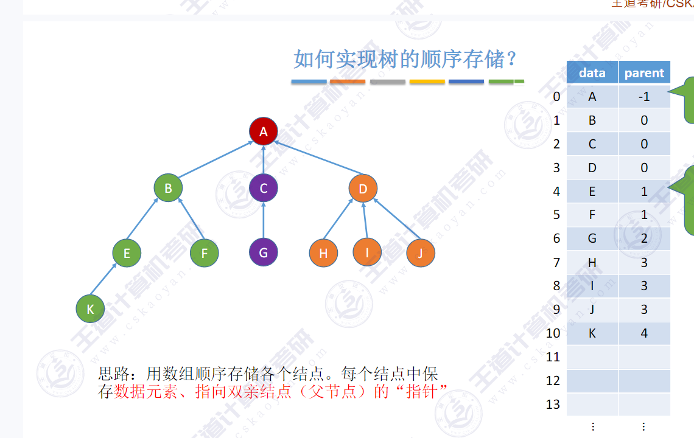
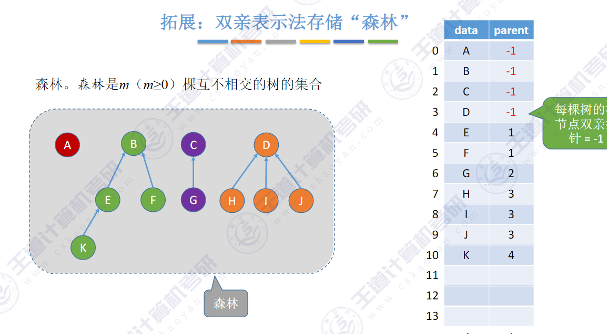
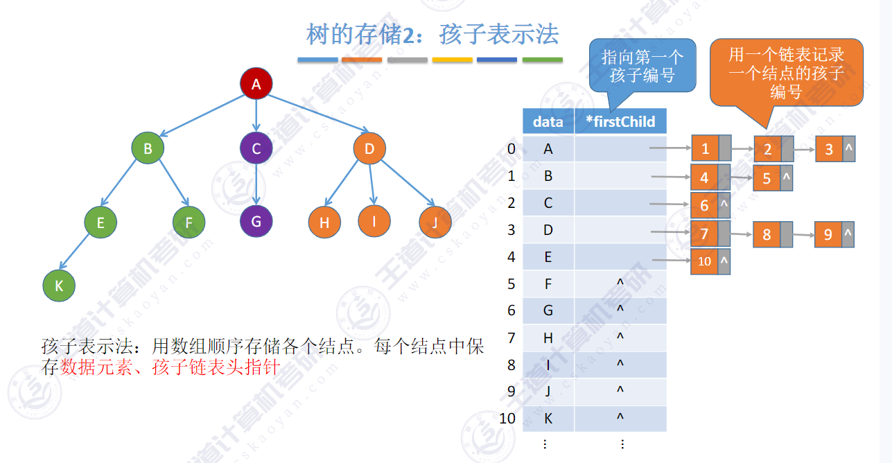
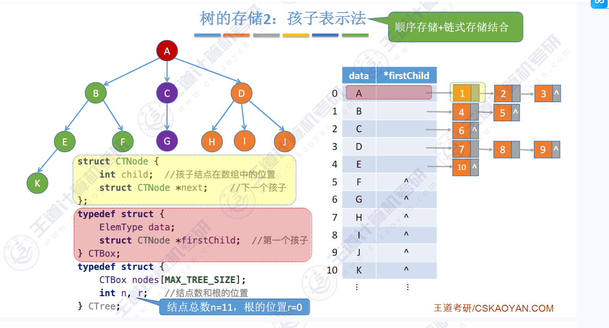
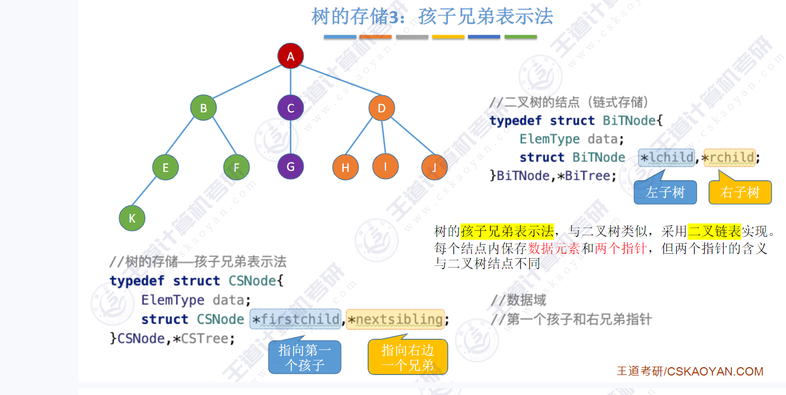
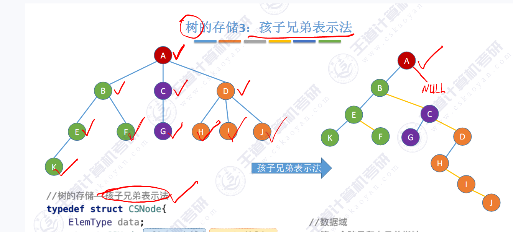

> 树与森林

- 树的存储方式
  - 双亲表示法
  - 孩子表示法
  - 孩子兄弟表示法

**双亲表示法**就是用一个一维数组来实现的,就是每个结点除了记录本身的data以外,还有一个parent指针指向双亲结点的下标是这么定义的

```C
#define MaxTreeSize 100;
typedef struct {
	ElemType data;
	int parent;
} PTNode;
typedef struct {
	PTNode nodes[MaxTreeSize];//双亲表示法
	int n;//节点数
}PTree
```



每个结点的parent 指向自己的双亲结点 直到parent 小于0 



双亲表示法也可以表示森林 也就是每棵树的根节点的parent  == -1

如果要找某个节点的根节点是哪个 可以一次循环直至找到根节点

```C
void Find(PTree &T,PTNode &x){ //T为要找根节点的结点
	int parent = x->nodes[parent];
	while(parent >= 0){
		parent = x->nodes[parent];
	}
    x = x->nodes[parent];
}
```

双亲表示法只能向上寻找,无法向下寻找,也就是无法完成找孩子的行为;如果要找孩子需要从头遍历整个数组

**孩子表示法:**



孩子表示法类似双亲表示法,就是指针域从指向双亲结点变成了 指向第一个孩子的下标

然后孩子结点中又记录了下一个孩子的地址



用孩子表示法表示森林需要记录多个根的位置;

如果用孩子表示法找孩子很方便,但是无法找双亲

**==孩子兄弟表示法:==**



孩子兄弟表示法 类似于二叉链表 不过这个链表的左指针指向的是 第一个孩子然后右指针指向的是他的右兄弟(如果有的话);




怎么将树转换成二叉树呢?

首先: 从层序的视角来做这件事:

从第一层依次遍历树, 第一个是A 结点,先将A的三个孩子全部穿起来,然后再将A的左指针指向B结点,

然后开始处理B结点,B结点有两个孩子,直接E,F穿起来 然后E是B的第一个孩子,B的做指针指向E结点,然后依次处理C,D,E,F ......

如果要将二叉树转换为森林或者树呢?

首先A结点在二叉树中是根结点,则不用犹豫.它在原树中也是根节点.

先将A恢复,然后层次遍历  恢复后的树,第一个结点是A

从二叉树中找到A的左孩子,是B,C,D,然后依次恢复,然后依次恢复,B,C,D的孩子

#### 树的遍历

树的先根遍历就是二叉树的先序遍历 

树的后根遍历就是二叉树的中序遍历  // 也叫做**深度优先遍历**

树的层序遍历 叫做**广度优先遍历**

