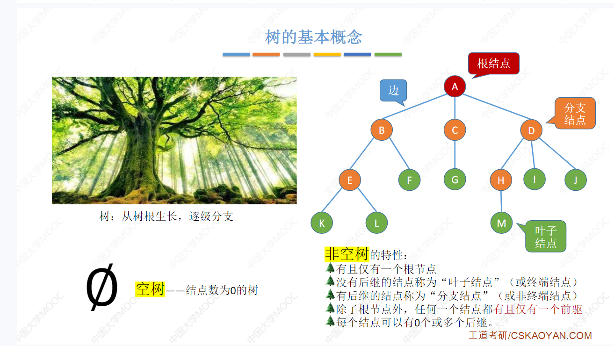
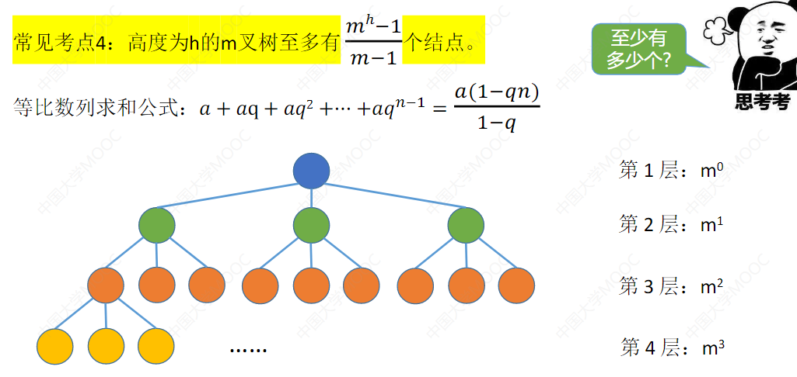
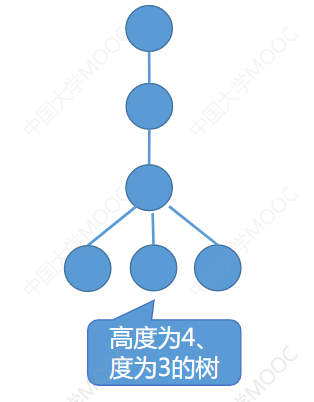

> 5.1 树的基本概念

除了根结点之外每个结点有且仅有一个前去

每个结点可以有0或多个后继

**节点的度** 

**结点的度: 一个结点的孩子的数量称为节点的度.**

**树的度:树的度就是树中最大的结点的度**

**分支节点:度数大于0的结点称为分支结点**

**叶子结点:度为0(也就是没有孩子)的结点称为叶结点**

**有序树:就是左右孩子都是有次序的 不能更换的称为有序树**

>  5.1.3 树的性质

1. 树的结点数n等于所有结点的度数之和+1;

   - 使用N~i~ 来表明度为i的结点的个数 则 整个树的度为 N~1~+ N~2~ +..... N~i~ 

2. 度为m的树中第i层上至多有 m^i-1^个结点 

3. 高度为h的m叉树至多有

   1. 
   2. 这是一个简单的等比数列的前n项和的公式       a1*(1-m^h^)/(1-m) 将等式× -1 得到上图公式

4. 度为m丶具有n个结点的树的最小高度h为[log~m~(n (m-1) + 1)]

   1. **这个公式是这么推导出来的 首先 一共有n个结点 其次假设小高度为 h 则 h层度为m的树  最大的结点数为:(m^h^ -1 ) / (m - 1) **

      则 这个 n 一定是小于等于 h层最大的结点数的 .而且他又大于 第h-1 层 树的 最大结点数,就可以得到这个不等式

      - (m^h-1^ -1 ) / (m - 1) < n ≤  (m^h^ -1 ) / (m - 1)   然后通分 去分母,  得 (m^h-1^ -1 ) < n *  (m - 1) ≤  (m^h^ -1 )  然后同时取对数 得到 

      - **[log~m~(n (m-1) + 1)]**

      - ## 这个公式最重要的是 n 一定是小于等于最大高度h得最多节点数 并且多于高度为h-1的树的结点数..

5. 度为m,具有n个结点的树的最大高度是  n - m +1

   1. 这个是怎么推出来的
      1. 首先 如果想让一个树尽可能地高,就让他尽可能的廋也就是 
         1. 
         2. 如此 如果排除度为m的那一层结点 ,则其他的结点分别都能单独作为一行,总共有 n - m 行
         3. 但是 m个叶节点的那一行也算一行,则再加上1 就得到了最大高度
   2. 