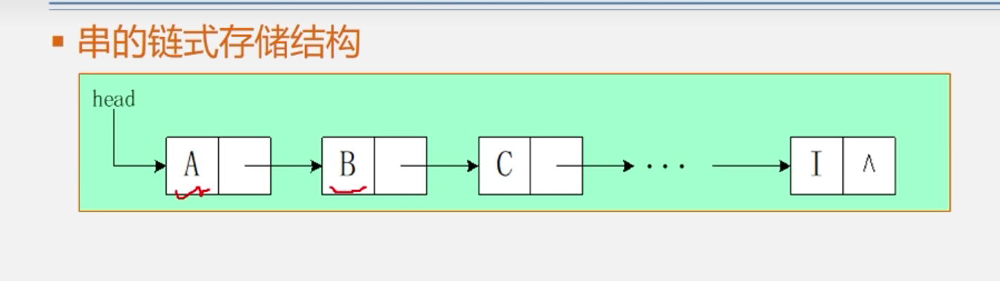

> 串的定义:

串(string) 是 有零个或多个字符组成的有限序列一般记为:

​				S = 'xxxxxxxxxx';

其中S中字符的个数n为串的长度.n=0时表示空串 *空串*用*符号* “Φ” 表示，它的长度为 0。

串中连续多个字符组成的子序列称为串的子串；

例如有串A='BEI JING';

则B='BEI';C='JING';均为串A的子串  同时 B在A中的位置是1，C在A中的位置是5；

需要注意的是由一个或者多个 空格组成的串 叫做“空格串”  （' ','     '）;

顺序存储结构定义：

```C
#define Maxsize = 255;
typedef struct {
    char ch[MaxSize];
    int length;
}SString
```

**也使用链表来定义一个串**

串的链式存储结构如下：



链串虽然操作方便，可以一直next  继续下去，但是由于  串是一个由N个**字符**组成的序列 所以每当存储1B的字符的时候 还需要需要4B来存储下一跳的指针虽然操作很方便。但是他对空间的浪费也是很高，有一种虽然家里的房子只有100m^2^ 但是需要 80m^2^来存放钥匙 这样离奇的操作。


串的存储密度计算：         

​	如果我们每个结点只存一个个字符的话。那么一个结点的存储密度根据存储密度计算公式可以存储密度等于1B/(1+4)B 存储密度居然低到20%足足浪费了80%的空间。由于这个浪费太过严重。于是可以使用**块链结构（一个结点可以存放多个字符）** 即如下结构


这样 存储密度可以达到4B/(4+4)B =50%； 一个结点可以多放一些字符来提高存储密度。

> 串的基本操作

- StrAssign(&T,chars);将T赋值为chars
- StrCopy(&T,S); 将S复制给T
- StrEmpty(S);判断串S是否为空
- StrCompare(S,T);将S和T对比 其实就是对比ascll码 如果S==T 返回0
- **Index(S,T);这个很重要  就是在S中查找T第一次出现的位置 如果找到了,则返回T在S中的位置**
- .......

**串的匹配(Index);**

目前王道书上面有两种模式匹配分别是

1. 朴素模式匹配(暴力匹配)
2. KMP 匹配 

### 朴素模式匹配

代码思想:

先将主串和模式串进行左对齐:然后从左向右依次增加,如果匹配成功一个字符 就向有移动一个字符,如果匹配失败则模式串回到开头,主串回到本次匹配的开头位置的下一个位置;


代码实现如下:

```C
int index(S,T){
    int i = j = 1;
    while(i<= S.length && j<= T.length){
        if(S.ch[i] == T.ch[j]){ //当前字符能匹配成功 进而匹配下一个字符
            j++;i++;
        }else{//指针后退重新匹配;
            i = i-j+2;
            j = 1;
        }
    }
    if(j>T.length) return i-T.length;
    else return 0;
}
```

设n为主串的长度,m为模式串的长度

暴力匹配最坏时间复杂度为O(m*n)


KMP算法.

KMP算法就是用特殊的算法生成一个数组,这个数组标志的 如果第n个元素匹配失败后模式串应该后退到第几个位置,而主串不用往后退,不需要每次都回溯.

KMP算法中最重要的就是求出next[]数组;

如何求next数组呢? 假设模式串为'abcac'  

**首先 第一位的元素的next 无脑写0,第二位的元素无脑写1;**

然后看第三个字符'c'

**算了这一块我只会求next数组,无法用嘴巴说出KMP算法的实现原理,回头补上吧//todo**

| 编号 |  1   |  2   |  3   |  4   |  5   |
| :--: | :--: | :--: | :--: | :--: | :--: |
|  S   |  a   |  b   |  c   |  a   |  c   |
| next |  0   |  1   |  1   |  1   |  2   |


KMP算法代码实现

```
int kmp_index(S,T,char next[]){
	int i = j = 1;
	while(i <= S.len.gth && j<= T.length){
		if(j==0 || S.ch[i]==T.ch[j]){//如果匹配成功则就是同时向后匹配,也有一种可能就是 匹配失败的位置就是第一个位置,就需要将模式串的指针指向模式串的第一个位置的前一个位置,然后主串和模式串一起向后匹配
			j++;i++;
		}else{//如果匹配失败的话 则 将模式串的指针指向 该指向的位置 也就是 j = next[j];
			j = next[j];
		}
	}
}
```

