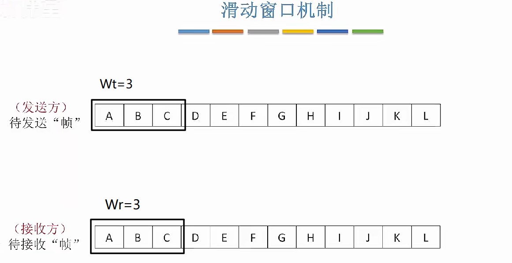

> #### 3.4.1 流量控制和滑动窗口机制
>
> 数据链路层流量控制就是通过滑动窗口机制来实现的
>
> 所谓滑动窗口机制就是 数据的通信分为接受方和发送方
>
> 发送方每次只发送当前在发送窗口内的数据
>
> 接收方也每次只接受数据编号在接受窗口内的数据

滑动窗口流量控制的基本原理 

​	数据的通信分为接受方和发送方 然后分别对应的窗口为：W~t~发送窗口（transmit）;W~r~接受窗口（receive）本文后面使用W~r~W~t~来代替中文，此时该案例中W~r~W~t~皆等于三 也就是说 发送方现在已经**允许**发送“A","B","C" 这三个数据，但是还没有发送 接收方的W~r~也落在了“A","B","C"  上 代表接收方已经准备好接受这三条数据了。

​	接下来发送方依次发送A、B、C三个帧，当接收方收到这三个帧后对三个数据帧进行确认已收到 当接收方发出确认帧ACK后

接收方的W~R~向后滑动准备接受DEF三个帧而W~t~接收到确认帧后向后滑动窗口准备发送DEF三个数据帧，下图黑色实心箭头为数据帧 黑色空心箭头为确认帧

​	当完成上述的操作后数据通信的双方的窗口下图所示：

这样就对基本的滑动窗口的原理进行了一个解释

在数据链路层 实现滑动窗口协议 主要有三种 停止等待协议(Stop-Waiting)；后退N帧协议（Go-Back-N）；选择重传（Select-Retransmit）

- ​	滑动窗口协议都规定了 W~r~+W~t~≤2^n^； 其中 n是给数据帧编号的比特数  即编号最大为3的话 也就是编号为0,1,2,3 四个 就需要两个比特来对窗口编号 此时n就是2

1. **停止等待协议**  **S-W**

   1. S-W协议规定了 W~r~=1，W~t~=1；此时只需要一个比特来对窗口编号

      1. 

      2. 此时发送方已经准备好了要给接收方的数据帧 DATA0 然后接收方正确接收到数据检查无误后就会给数据的发送方返回一个确认帧ACK0 同时当接收方发出ACK0的同时，接收窗口向右滑动一格，准备接收DATA1，当ACK0被发送方正确接收后发送方的窗口向右滑动一格，准备发送DATA1

      3. 

      4. 上面是正常的发送接受双方都能正常接收到帧的情况，若是发送时DATA或者ACK因为信道干扰通信链路发生故障没有到达的情况或者发送来的数据被检测到有差错是就需要发送方重传DATA，此时为了超时重传和判定重复帧的需要，发送方和接收方都需要设置一个帧缓冲区，当发送方发送完数据后在发送缓存中保留该数据帧的副本，当长时间未收到确认帧ACK后会触发超时重传机制，会再次发送该数据，直到收到该数据的确认帧ACK才会清除副本。

         - 有两种情况 分别是 DATA丢失 和 ACK丢失

           - > DATA丢失 

             

             在数据帧丢失的情况下，计时器超时后自动重传，同时计时器会自动重置，直至收到该数据帧的确认帧ACK

           - > ACK丢失				

             接收方的接受窗口在发送出ACK的同时就向右滑动一格，假设ACK在信道传输的过程中丢失后

             此时 接收窗口已经变成了0 但是由于ACK在传输过程中丢失，发送方的计时器直到超时也没有接收到该数据的确认帧就会重发此数据帧，然后接收方收到了DATA1数据帧，但是该数据帧对于接收方来说是重复帧会选择丢弃改帧然后重发重复帧的ACK，发送方收到该数据的ACK后 窗口滑动一格

             

             **若不对帧进行编号会导致什么？**

             ​       若不对帧进行编号在迟迟没收到确认帧ACK后 发送方会进行数据帧超时重传，但是因为没有数据帧的编号，接收方就无法区分是不是重复帧，因为接收方不知道自己的ACK发送方有没有收到

2. **后退N帧协议 GBN**

   1. 后退N帧协议规定了  W~r~=1，W~t~＞1

      1. 关于==确认帧== GBN协议规定了接收方可以采取累积确认，即接收方可以正确收到多个数据帧时，只返回最后一个数据帧的ACK_i 代表i号之前的所有数据都已接收完毕。

      2. 关于==超时重传== 若发送方迟迟未收到ACK_i 会重新发送i和i之后的所有数据帧 

      3. 后退N帧协议工作方式：

      4. <video src="../../image/计算机网络/Video_2025-01-02_211642.mp4"></video>

         后退N帧会采用累积确认的方式来对数据进行确认

         - 假设 现在发送窗口=3，接收窗口=1；

         - 此时如果发送方发送了0,1,2三条数据，然后接收窗口会在每接收到一个数据的同时将自己的接受窗口向右滑动一个格。进而接收1,2两个帧

         - 

         - 

         - 接收方在接收到data2的时候返回ACK2，表示2之前的数据都已经收到，然后发送窗口向右滑动。

         - > **上面是正确接收并且正确确认的情况，现在假设发送的某个帧发送途中丢失了，或者发现数据错误被丢弃了，（编号为i的帧）因为接收方是按序接收数据的，那么i帧丢失以及i之后的帧到达了接收方也不会丢失，只会返回出问题的第i-1个帧的ACK_i-1，而出问题的第i个帧迟迟收不到ACK直到计时器超时，然后重新发送**

         - 

         - 此时0号帧无法正常被接收方接收，导致 即使 1号帧到达了接收方，但是没有落在接收方的接受窗口内，也会被丢弃。这时，接收方会返回ACK3，告知接收方3号帧及以前的帧都被收到了，接受窗口移动到3号帧后面。

         - 

         - 

         - > **若确认帧丢失呢？**

         - 接收方接收到数据，发出确认帧，然后将接受窗口向右一次滑动，若确认帧丢失，则会导致此前发送的n个数据帧得不到接收方确认，直至发送方计时器超时，重传该数据，但是会落在接收方接受窗口外，接收方会返回最后一个正确帧的ACK

           1. 

           2. 
         
           - > 若窗口大小不满足 W~r~+W~t~≤2^n^ 这个会出现什么
         
             若用2bit给帧编号，但是 W~t~ = 4，W~r~ = 1;两个加起来=5>2^2^ 若最后确认帧丢失，会导致发送方的迟迟收不到ACK直到计时器超时重发数据帧，但是接收方的窗口已经等待接收0这个窗口的数据，但是下一次发送来的重复数据帧序号也是从0开始，就会导致接收方无法分辨重复数据，会当做正常数据接收。
         
             
      
      3. **选择重传协议 SR**
      
         > 选择重传协议需要满足 W~r~+W~t~≤2^n^； W~r~ ≤ W~t ~  一般 两者取相同大小
      
         选择重传协议不支持累积确认，需要接收到一个数据帧就立即对该数据帧进行确认，同时SR与GBN和SW协议不同的一点就是 支持接收方向发送方发送否认帧==NAK（Negative Acknowledge）==的机制，目的是通知某个数据帧发生了比特错误被接收方主动丢弃，需要立即重传。
      
         选择重传协议工作方式：
      
         
      
         每次接收到数据帧都需要返回一个ACK帧，发出ACK帧的通知向右滑动接受窗口
      
         
      
         然后接收方正确接收ACK后向右滑动发送窗口
      
         
      
         > **若数据帧在发送过程中丢失？**
      
         
      
         此时接收方正确接收四号帧后发送ACK并向右滑动一格窗口，同时6,7号帧也到达接收方，接受窗口也接受6,7两个帧，并返回ACK但是没有接收到5号帧，所以窗口不继续向后滑动。之后发送方四号窗口接收到ACK发送窗口向右滑动1格。
      
         
      
         然后0号帧落入到发送窗口内，直接发送0号帧，之后5号帧迟迟没收到ACK计时器会超时，进行重传并且重置5号帧的计时器 。
      
         
      
         然后接收方返回ACK
      
         
      
         5号窗口和0号窗口接收到ACK向右滑动窗口。
      
         
      
         > 若帧内部出现比特错误，被接收方丢弃？
      
         若帧内部出现比特错误被接收方丢弃的话，接收方会丢弃该帧的同时发送一个否认帧，告知发送方序号为i的帧需要重传
      
         
      
         然后5号帧不必等待计时器结束，可以立即重传一个5号帧给接收方。但是4号帧已经被正确接收并被正确返回了ACK所以接收窗口和发送窗口都向右滑动一格。发送窗口落到了0号窗口，然后0号窗口会发送一个0号帧。
      
         
      
         > **确认帧丢失呢？**
      
         假设发送方给接收方发送了4个数据帧 都被接收方正确接收并返回了ACK，与此同时接收方的接受窗口向右滑动4格
      
         但是ACK1，ACK3因为通信故障丢失。则2发送方只能接收到ACK0，ACK2，ACK0是最先被接收到的，所以发送窗口向右移动1格。ACK2也被正确接收到。
      
         
      
         然后4号窗口落入发送窗口内，发送出去数据帧4. 直到1,3数据帧的计时器依次超时，然后发送方开始重传1,3数据帧。
      
         
      
         但是1,3两个数据帧对于接收方来说是已经被接收过的了，现在对于接受窗口来说数据帧1，3是属于重复帧，**收到重复帧的时候会返回重复帧的ACK**
      
         
      
         
      
         
