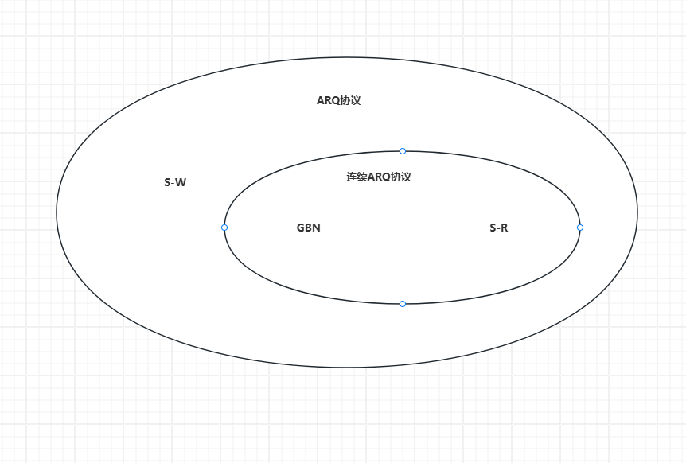

> #### **3.5 自动重传协议（ARQ）的信道利用率分析**

说起自动重传协议 408考试大纲中包括了3.4中学习的 S-W、GBN、S-R三种协议

其中 GBN和S-R属于连续ARQ协议，他们三个的关系如下

**何为信道利用率？**

信道利用率，也叫信道的效率，定义很多，但是常用的是**时间角度**的定义。对发送方而言，发送方在**一个发送周期内**，**有效地**发送数据所需要的时间**占整个发送周期**的比率。

那么什么是发送周期呢？

**发送周期**：发送方从发送第一个数据开始，到接收到第一个确认帧为止。

 **所谓的信道利用率即 当发送方从发送第一个数据开始，直到接收到第一个确认帧为止，这段时间内 有多少时间信道上是有数据通过的**

OK 直接上图

下面是S-W的信道数据通行情况：

计算公式：
$$
\frac{T_d}{T_d+RTT+T_a}
$$
S-R和GBN协议信道利用率分析雷同：主要是窗口大小乘上单个数据的信道利用率即可获取到发送周期内的信道利用率

计算公式为：
$$
\frac{N*T_d}{T_d+RTT+T_a}
$$
其中N为发送方的窗口大小

**信道利用率最大为100%**