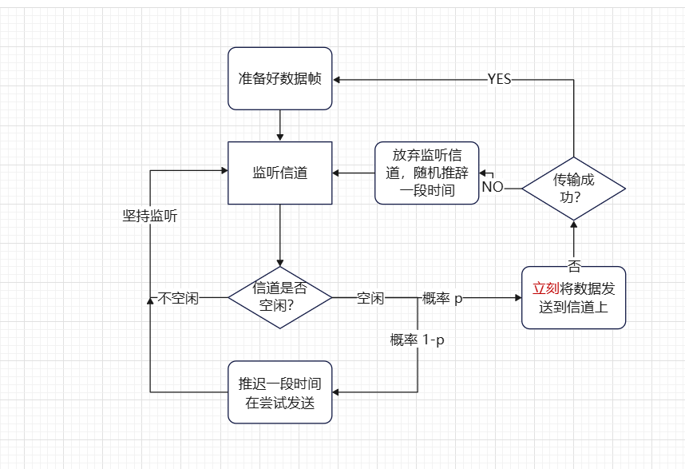
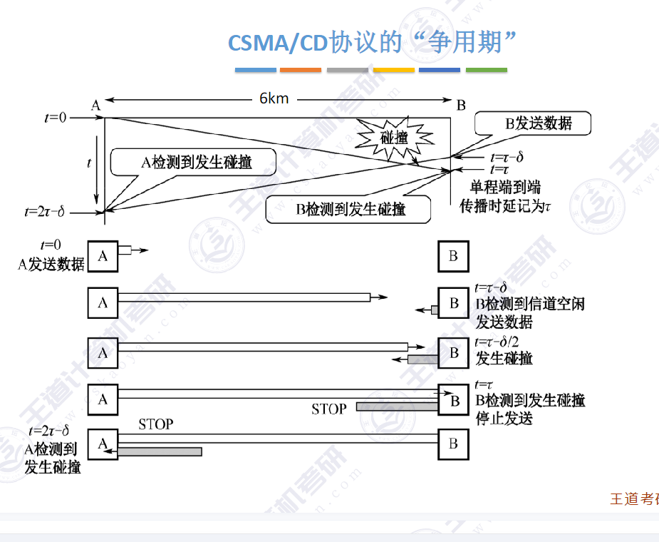

> **3.6 介质访问控制**

**什么是介质访问控制以及为什么需要介质访问控制？**

**3.6.1. 信道划分介质访问控制**

​	一般局域网都是使用的集线器以及n台主机串起来的网络拓扑结构；类似于一下该图

由于集线器会无脑的将收到的网络信号发送到所有的接口，相当于所有的计算机都共享同一条信道，为了使计算机发送数据相互之间不受干扰，所以就需要介质访问控制，来尽量避免一台主机发送数据的时候，其他主机不干扰该主机。

**信道划分介质访问控制**

​	信道划分介质访问控制就是使用某个方式来将信道来分开供给不同的节点别使用，信道划分介质访问控制分为：时分复用（TDM）、频分复用（FDM）、码分复用（CDM）、波分复用（WDM）；	

-  时分复用（TDM）
  - 时分复用就是将一个信道的可用时间平均分配给m个节点；然后每个节点使用这个信道的 (1/m)的资源来。
  - 
  - 例如一个TDM帧为1s 则这三个节点分别只能获得这个信道的1/3的时间来发送数据，则每个节点最多可以获得信道的1/m的最大发送速率
- 统计时分复用：时分复用还有一个进阶版本统计时分复用（STDM）
  - 统计时分复用又称异步时分复用， 在TDM的基础上，动态按序分配时隙
  - 
- 频分复用（FDM）
  - 频分复用就是将一个信道的带宽拆分开来，然后分配给A、B、C
  - 
  - 复用器就是可以节点发出的信号复合到信道上，分用器就是将信道上的子频带分离出来
- 码分复用（CDM）//todo 

**3.6.2 随机访问介质访问控制**

​	随机访问介质访问控制

在随机访问介质访问控制中我们要学习的就这四种协议：

先来看第一个ALOHA协议：ALOHA协议流程图如下：

**这个图中ACK超时后会随机等待一段时间进行重传，为什么要随机等待一段时间而不是等待一个固定的时间重传呢？**

​	

看这张图，如果不是随机等待一段时间，而是等待固定时间大小，b_1帧和c_1帧只要是发生了冲突，则就永远的冲突下去，就导致永远发送不了数据了。

那么时隙ALOHA协议是怎么回事呢？来看下流程图 

aloha 和时隙ALOHA唯一的不同就是时隙ALOHA协议将时间分为固定大小的“时隙”，这个时隙足够发送完一个数据帧的时长，即使两个数据帧分别在两个不同的时隙准备好，但是只要他们发送的时隙不同也就不会发生冲突。来看他们发送数据的一个例子：

在这个例子种，如果用的是纯ALOHA协议的话，b_1帧和c_1帧 两个帧发送时间离得很近，如果是直接发送数据帧的话，就会导致b_1帧还来不及发送完数据，c_1真就要发送数据了，然后两个就会发送冲突，而在时隙ALOHA协议中，虽然两个数据帧都准备的时间离得不是很远，由于时隙的存在，导致b_1很快就可以发送数据帧，而c_1要等待下一个时隙才可以发送数据帧，从而让两个数据帧发生的冲突的概率变小。

CSMA协议： CSMA 协议是在 ALOHA 协议基础上提出的一种改进协议，它与 ALOHA 协议的主要区别是多了一个载波侦听装置。（先听后发） 也就是再发送数据之前需要先监听数据信道是否空闲，如果空闲才会发送数据，否则就等会再发送。同时CSMA协议还分为了：1-坚持CSMA协议，非坚持CSMA协议，p-坚持CSMA协议。（2025-1-7写 流程图有的是矩形，有的是圆角矩形这个无其他意思，只是看着长得像没区分）

- 1-坚持CSMA协议流程图如下
  - 
  - 1-坚持CSMA协议具备若信道不空闲则一直监听信道，若信道空闲则以1的概率数据帧发送到信道上，但是这样有一个坏处，若是有多个节点准备好了之后，一旦检测到信道空闲，多个节点会同时发送数据到信道上，导致数据发生冲突，于是就有了非坚持CSMA协议
  - 非坚持CSMA协议
    - 
    - 非坚持CSMA协议相较于1-坚持CSMA协议改进了 关于监听信道发现信道忙碌的时候会放弃监听信道，推迟一段时间再次重复这个“动作”；
      - 优点：当多个节点都已准备好数据时，如果信道不空闲，
        则各节点会随机推迟一段时间再尝试监听，从而使各节点
        “错开”发送数据，降低冲突概率。
      - 缺点：信道刚恢复空闲时，可能不会被立即利用，导致信
        道利用率降低
  - p-坚持CSMA协议
    - 
    - p-坚持CSMA协议属于1-坚持和非坚持的折中版
      - 提高信道利用率的同时，也降低了冲突发生的概率（相对于1-坚持CSMA协议来说）
- **CSMA/CD协议 载波侦听多路访问／碰撞检测（Carrier Sense Multiple Access with Collision Detection, CSMA/CD）**
  - CSMA/CD协议属于CSMA的改进版，“载波监听” 就是发送前先监听信道，即每个站点发送数据之前先监听信道上是否有其他站点正在发送数据。“碰撞检测”，就是边发送边检测是否我发送数据的时候 也有其他的站点也发送了数据导致我发的这个数据发生比特错误。如果发生冲突之后就会停止发送数据然后推迟一个随机的时间重新发送数据。（原因：当两个帧发生冲突时，两个被损坏帧继续传送毫无意义，而且信道无法被其他站点使用，对于有限的信道来讲，造成很大的浪费。如果站点边发送边监听，并在监听到冲突之后立即停止发送，可以提高信道的利用率。）总结起来就是十六个字 **“先听后发，边听边发，冲突停发，随机重发”**
  - 如何实现随机重发？使用截断二进制指数退避算法来确定重传时间
    - 截断二进制指数退避算法——在第k次传输失败发生的时候在[0,1,2,3,4,......2^k^-1]这个集合里随机选一个数字*争用期
      - 举个例子 在第一个发生冲突的时候 数字集合就是0-2^1^-1选一个数字 那么这个集合就是[0,1]
      - 到了第二次就变成了[0,1,2,3]
      - 第三次就变成了[0,1,2,3,4,5,6,7]
      - ......
      - ......
      - 直到到了第10次之后k就不在增加[0,1,2,3,4,......2^10^-1]
      - .......
      - .......
      - 再到第16传输失败后 放弃传输上报网络层
    - **争用期是什么？**
      - 
        - 假设某个局域网的拓扑图如上图所示，现在假设信号在信道上传播的速度为X千米/s，每两个站点相距的距离均为m千米
        - 则相距最远的两个站点A<->D的距离为3m，然后A站首先监听信道发现信道空闲，开始发送数据，当A站点的第一个数据发送到信道上，也就是最多经过3m这个距离就可以到达D站点。换算成时间就是 [（3m千米）/（X千米/秒）] 暂且将这个时间记作τ，若在A发送的数据到达D站点之前，D站点也开始监听信道，由于A站点发送到信道上的数据还没有到达到D站点，D站点会认为此时信道是空闲的也会开始发送自己的数据，类似下图的感觉
        - 
        - **在这个情况其实A发出的数据已经和D发出的数据发生了冲突，D很快就可以知晓发生了冲突，会停止发送数据，但是由于A站点离冲突地点较远，则需要更多的时间才知道发生了冲突，如果将D发送数据之前到D发送的数据于A站点发送的数据发生冲突的这段时间记作θ，当θ无限趋于0的时候，A站点知晓到发生冲突的时间无限接近于2τ，也就是最多经过时间2τ之后信道上的所有站点都会知道有没有发生冲突争用期就是一个网络中，最远的两个站点的两倍的单向传播时延**
        - 
      - CSMA/CD协议"最短帧长"限制
      - 上面我们讲了争用期这个概念，为什么要规定最短帧长这个东西。其实也是跟信道冲突有关系，假设一个帧就只有1bit，先到的传输速率为10Mbps，则根本用不到1us这个数据帧就会发送出去，但是要经过60us才可以到达站点D，就会导致A根本察觉不到帧发生了冲突，实际这个帧已经发生了冲突了。为了解决这个问题，所以要有了最短 帧长这个概念 
      - 最短帧长 = 2*最大传播时延 * 数据传输速率 ，其中2*最大传播时延 就是**争用期** 而数据传输速率就是带宽 最短帧长也等于 争用期 * 带宽 **争用期也就是一个站点源源不断的发送数据到信道上，到多久之后能被所有的站点检测到**
      - 以太网规定了最短帧长为64B 最长帧长为1518B
- CSMA/CA协议 Carrier Sense Multiple Access Collision Avoidance

​	